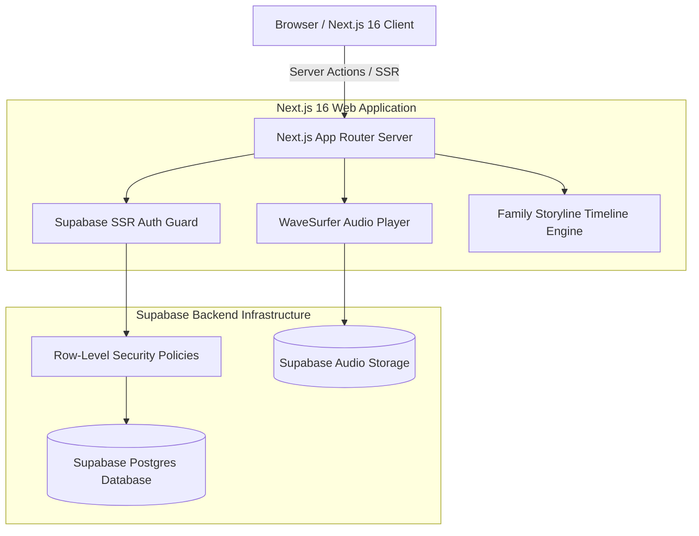

# 🌐 TimeLog Web Architecture Blueprint

  <b>English | <a href="./ARCHITECTURE_zh.md">简体中文</a></b>

This document details the Next.js 16, Supabase Row-Level Security, and cross-generational storytelling curation dashboard powering **TimeLog Web**.

---

## 🛡️ 1. Zero-Trust Row-Level Security (RLS)
- Ensures family story archives and private voice journals are strictly accessible only by verified family members via Postgres database-level RLS policies.

---

## 🎵 2. WaveSurfer Audio Waveform Visualization
- Renders high-fidelity audio waveforms with synchronous text-to-audio highlighting for immersive storytelling review.

---

© 2026 TimeLog Web. Licensed under the MIT License.
