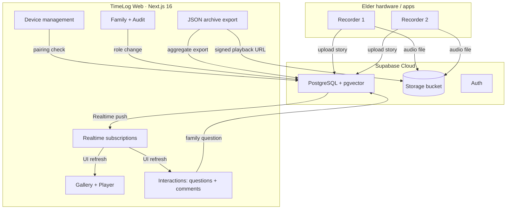
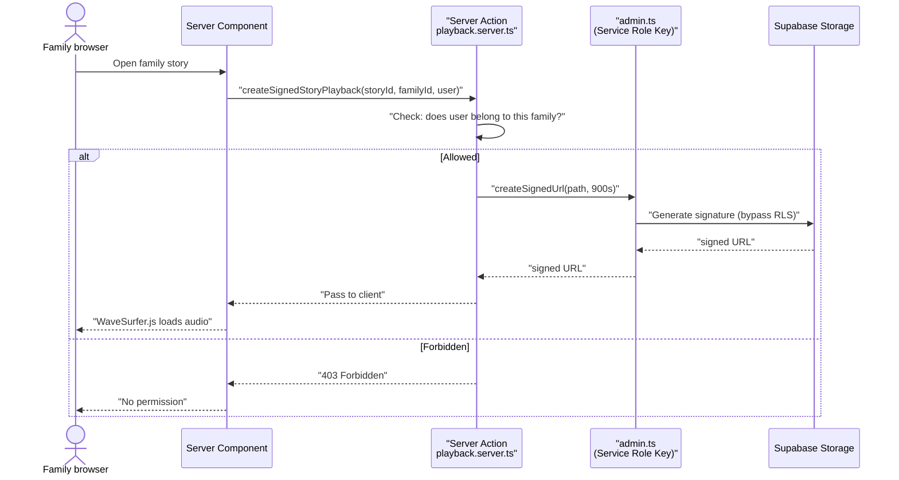

<!-- 
  Designed & Built with ❤️ by MeiSiristhebest (https://github.com/MeiSiristhebest)
  If this repository helps your learning or engineering, please consider dropping a ⭐ Star!
-->
# TimeLog Web 🕰️

<p align="center">
  <b>English | <a href="./README_zh.md">简体中文</a> | <a href="./README_TH.md">ภาษาไทย</a></b>
</p>

> [!TIP]
> 💡 **If this architecture, engineering implementation, or toolchain helps your learning or workflow, please drop a ⭐ Star!**
> 📚 Explore the technical blueprint: [ARCHITECTURE.md](./ARCHITECTURE.md)


<p align="center">
  <a href="https://github.com/MeiSiristhebest/timelog-web/actions/workflows/ci.yml"></a>
  <a href="https://app.netlify.com/sites/timelog-web/deploys"></a>
  <a href="https://github.com/MeiSiristhebest/timelog-web/blob/master/LICENSE"></a>
  
  
  
  
  
  <a href="DESIGN.md"></a>
</p>

<p align="center">
  <a href="README.md">🇨🇳 中文</a> &nbsp;|&nbsp; <a href="README_EN.md">🇺🇸 English</a> &nbsp;|&nbsp; <a href="README_TH.md">🇹🇭 ไทย</a>
</p>

---

<p align="center">
  <strong>Cross-generational family story preservation &amp; governance console</strong>
</p>

## Table of Contents

- [About](#about)
- [Features](#features)
- [Requirements](#requirements)
- [Installation](#installation)
- [Quick Start](#quick-start)
- [Configuration](#configuration)
- [Architecture](#architecture)
- [Project Structure](#project-structure)
- [Tech Stack](#tech-stack)
- [Development Commands](#development-commands)
- [Contributing](#contributing)
- [Security](#security)
- [Deployment](#deployment)
- [License](#license)

---

## About

TimeLog Web is the web console of the TimeLog family-memory system — a place where family members manage elder-recorded story audio, AI-generated transcripts, and semantic indexes.

**The problem**: Elders carry a lifetime of stories, but in many families grown-up children live apart and three-generation households are rare. Shared family memories fade quickly when transmitted only by word of mouth. TimeLog Web brings elder-recorded stories into one place so family members can:

1. Browse and play the full family story archive
2. Send guided questions to trigger new recordings
3. Comment with text or voice, organised by family role
4. Search the whole story corpus with a single query (semantic search)
5. Export everything as JSON — your data, not locked in
6. Pair devices and set friendly aliases
7. Use the app in English, 中文, or ไทย
8. Enjoy a WCAG 2.2 AAA high-contrast accessible interface

> **Why not just use a family photo album app?** Because those are built for photos, not long-form audio. They don't offer transcript-audio highlighting, semantic story retrieval, RLS-based fine-grained family permissions, or the "family asks → elder records → family comments" interaction loop. TimeLog fills that gap.

---

## Features

| # | Feature | How it works | Notes |
|---|---------|-------------|-------|
| 1 | **Secure audio playback** | Audio lives in a private Supabase bucket. The server validates family membership and generates a time-limited signed URL for WaveSurfer.js | Signed URLs are valid for 15 min and auto-refresh |
| 2 | **Two-way interaction** | A guided-question tracker (`prompts-tracker.tsx`) shows status; Web Audio API captures voice comments | 30+ ready-to-use question templates |
| 3 | **Passwordless device pairing** | Pairing codes connect elder devices to the family. Rename them in the console (e.g. "Grandma's Voicebox") | Works with Android / iOS elder apps |
| 4 | **Semantic search** | Story transcripts are embedded into PostgreSQL via pgvector — one query finds the most relevant passages | Uses `text-embedding-3-small` |
| 5 | **Trilingual i18n** | `next-intl` drives the whole app. All strings live in `messages/{en,zh,th}.json` | No page reload on language switch |
| 6 | **Accessible design system** | Obsidian + Parchment + Sand palette; Cormorant Garamond + Instrument Sans typography; focus rings ≥ 3:1 contrast | See [DESIGN.md](DESIGN.md) |
| 7 | **Data-sovereignty export** | A Server Action aggregates stories, transcripts, comments, and metadata into a single JSON archive | GDPR-compliant data portability |
| 8 | **Realtime sync** | Supabase Realtime subscribes to Postgres changes — the UI updates in seconds | Auto-reconnects after tab suspend |
| 9 | **Audit log** | Family, device, role, and export actions are logged; admins can filter by time | Admin-only access |

---

## Requirements

| Dependency | Minimum Version |
|------------|-----------------|
| **Node.js** | 20.19.0 |
| **pnpm** | 10.33.0 |
| **Supabase** | A Supabase project (Free plan is fine) with PostgreSQL, Storage, Auth, Realtime, and pgvector enabled |
| **Browser** | Chrome 110+ / Safari 16.4+ / Edge 110+ / Firefox 113+ |
| **(Optional) Netlify** | For one-click deploys; Vercel is also supported |

---

## Installation

### 1. Clone and install

```bash
git clone https://github.com/MeiSiristhebest/timelog-web.git
cd timelog-web

# Recommended: pin pnpm with Corepack
corepack enable
corepack prepare pnpm@10.33.0 --activate

# Install dependencies
pnpm install --frozen-lockfile
```

### 2. Initialise Supabase

Run the SQL scripts from the repo root in the Supabase SQL Editor:

```bash
psql <your-pg-conn-string> < supabase-role-management.sql
psql <your-pg-conn-string> < supabase-admin-setup.sql
psql <your-pg-conn-string> < supabase-fix-rls.sql
psql <your-pg-conn-string> < supabase-quick-admin.sql
# Optional: simplify roles
psql <your-pg-conn-string> < simplify-roles.sql
```

### 3. Verify language files

```bash
ls messages/
# Must contain: en.json  zh.json  th.json
```

---

## Quick Start

> Prerequisites: installation steps completed, Supabase reachable.

```bash
# Start dev server
pnpm dev
# Visit http://localhost:3000

# Run the full quality gate
pnpm check
# lint → typecheck → test → build
```

**Expected output**:

```bash
▲ Next.js 16.x.x
- Local:        http://localhost:3000
- Environments: .env.local, .env
✓ Ready in XXX ms
```

### Browser smoke test

1. Open `http://localhost:3000`, log in with the admin account created by `supabase-quick-admin.sql`
2. **Story Gallery**: browse elder recordings (empty state is fine)
3. **Device Management → Add Device**: generate a pairing code, pair, rename (e.g. "Grandma's Voicebox")
4. **Family Members**: invite a new member, set role
5. **Audit Logs**: confirm actions are recorded
6. **Accessibility**: Lighthouse Accessibility scan, target ≥ 98

---

## Configuration

Create `.env.local` at the repo root:

```env
# Supabase client anon key (safe to expose to the browser)
NEXT_PUBLIC_SUPABASE_URL="https://xxxxxxxxxxxx.supabase.co"
NEXT_PUBLIC_SUPABASE_ANON_KEY="eyJhbGciOiJIUzI1NiIsInR5cCI6IkpXVCJ9......"

# Supabase Service Role Key (★ NEVER commit or expose to the browser ★)
# Used only in src/lib/supabase/admin.ts
SUPABASE_SERVICE_ROLE_KEY="eyJhbGciOiJIUzI1NiIsInR5cCI6IkpXVCJ9......"

# NextAuth (generate with: openssl rand -hex 32)
NEXTAUTH_SECRET="your-64-char-hex-secret"
NEXTAUTH_URL="http://localhost:3000"
```

---

## Architecture

### Overall flow



### Secure audio playback



**Key source files:**

- [subscriptions.ts](src/features/realtime/subscriptions.ts) — Realtime subscriptions
- [page.tsx](src/app/(dashboard)/stories/page.tsx) — Story gallery
- [admin.ts](src/lib/supabase/admin.ts) — Only module using Service Role Key
- [playback.server.ts](src/features/stories/playback.server.ts) — Signed URL generation

---

## Project Structure

```text
timelog-web/
├── .github/workflows/
│   ├── ci.yml                         # CI: ESLint + TSC + Vitest + Build
│   └── deploy.yml                     # Deploy to Netlify
├── messages/                          # i18n locales
│   ├── en.json                        # 🇺🇸 English
│   ├── zh.json                        # 🇨🇳 中文
│   └── th.json                        # 🇹🇭 ไทย
├── public/                            # Static assets
├── src/
│   ├── app/                           # Next.js 16 App Router
│   │   ├── (auth)/                    #   Sign in / Sign up
│   │   ├── (dashboard)/               #   Console
│   │   │   ├── stories/               #     Gallery + Player
│   │   │   ├── devices/               #     Device management
│   │   │   ├── family/                #     Family members
│   │   │   ├── audit/                 #     Audit logs
│   │   │   ├── search/                #     Semantic search
│   │   │   └── settings/              #     Preferences
│   │   └── api/                       #   API routes
│   ├── components/                    # Shared components
│   │   ├── admin/                     #   Admin components
│   │   ├── dashboard/                 #   Topbar, sidebar, empty states
│   │   ├── layout/                    #   Layout components
│   │   └── ui/                        #   Radix + Tailwind primitives
│   ├── contexts/                      # Global contexts
│   ├── features/                      # Business modules
│   │   ├── admin/                     #   Archive export
│   │   ├── audit/                     #   Audit logs
│   │   ├── devices/                   #   Device pairing
│   │   ├── family/                    #   Member management
│   │   ├── interactions/              #   Questions + comments
│   │   ├── realtime/                  #   Realtime subscriptions
│   │   └── stories/                   #   Story core
│   ├── hooks/                         # Shared hooks
│   ├── i18n/                          # next-intl config
│   ├── lib/
│   │   ├── supabase/
│   │   │   ├── client.ts              #   Client SupabaseClient
│   │   │   ├── server.ts              #   Server SupabaseClient
│   │   │   ├── admin.ts               #   ★ Service Role Key only entry point ★
│   │   │   └── env.ts                 #   Env validation
│   │   └── hooks/                     #   Zustand stores
│   └── types/                         # Global types
├── DESIGN.md                          # Design system spec
├── LICENSE
├── middleware.ts                      # Next.js middleware
├── next.config.ts                     # Next.js config
├── netlify.toml                       # Netlify deploy config
├── eslint.config.mjs                  # ESLint 9 config
├── package.json
├── pnpm-lock.yaml
├── tsconfig.json
└── supabase-*.sql                     # Supabase SQL scripts
```

---

## Tech Stack

| Category | Technology | Notes |
|----------|------------|-------|
| Framework | Next.js 16.2.2 (App Router) | Server rendering + file routing |
| UI | React 19.2.4 + Tailwind CSS 4.2.2 | Accessible components built on Radix UI |
| Data / Backend | Supabase 2.102 (PostgreSQL + pgvector + Storage + Auth + Realtime) | Vector search & signed playback |
| Internationalisation | next-intl | EN / ZH / TH, no reload on switch |
| State | Zustand | Lightweight client state |
| Audio | WaveSurfer.js + Web Audio API | Waveform playback & recording |
| Language | TypeScript | Fully type-safe |
| Testing | Vitest | Unit tests |
| Deployment | Netlify / Vercel | Static assets + server functions |

---

## Development Commands

```bash
pnpm dev                      # Dev server, port 3000
pnpm dev:host                 # Expose to LAN
pnpm build && pnpm start      # Production build + serve
pnpm lint                     # ESLint check
pnpm typecheck                # TypeScript check
pnpm test                     # Vitest
pnpm check                    # Full gate: lint → typecheck → test → build
pnpm lint --fix               # Auto-format
```

---

## Contributing

Contributions welcome. Quick flow:

```bash
# 1. Fork → Clone → Branch
git checkout -b feat/your-feature

# 2. Pass the quality gate
pnpm check

# 3. Commit and open a PR
git commit -m "feat: your change"
git push origin feat/your-feature
```

**Good first issues:**

- 🆕 New languages (Japanese, Korean, etc.): copy `messages/en.json` and translate
- 🧪 Vitest unit tests
- 🧩 Accessibility fixes

---

## Security

| Risk | Mitigation |
|------|-----------|
| **Service Role Key leak** | `.env.local` is in `.gitignore`; only `admin.ts` uses it; configure via env var panel |
| **Signed URL sharing** | 15-min TTL; can be shortened to 5 min in `playback.server.ts` |
| **RLS misconfiguration** | All tables have RLS enabled by default; run `diagnose-family-rls.sql` before changes |
| **Session hijacking** | HTTPS + Secure Cookies + SameSite=Lax in production |
| **Pairing code brute-force** | 5 attempts per 10 minutes → lockout |
| **Archive export leak** | Admin-only; all actions logged |

**Vulnerability disclosure**: Email **`maox_neta@foxmail.com`** — do not file a public issue. We commit to a first response within 24 hours.

---

## Deployment

### Netlify

1. Netlify → Add new site → Import this repo
2. Set environment variables:
   - `NEXT_PUBLIC_SUPABASE_URL`
   - `NEXT_PUBLIC_SUPABASE_ANON_KEY`
   - `SUPABASE_SERVICE_ROLE_KEY` (mark as Sensitive)
   - `NEXTAUTH_SECRET`
3. Deploy — first build takes ~2-4 minutes

### Vercel

Also supported. Add the same env vars in Vercel Project Settings.

---

---

## ⭐ Star & Support

If you find this project useful or inspiring, please consider giving it a ⭐ **Star** on GitHub! It helps more developers discover the work and supports continuous open-source maintenance.

<p align="left">
  <a href="https://github.com/MeiSiristhebest/timelog-web/stargazers">
    
  </a>
  <a href="https://github.com/MeiSiristhebest/timelog-web/network/members">
    
  </a>
</p>

### 🤝 Contributors
<a href="https://github.com/MeiSiristhebest/timelog-web/graphs/contributors">
  
</a>

## License

MIT License. See [LICENSE](LICENSE).

---

<p align="center">
  <em>Made with ❤️ for the Senior Project · WCAG 2.2 AAA Accessibility Standard for Elders</em>
</p>

<!-- Scarf Telemetry Pixel -->

