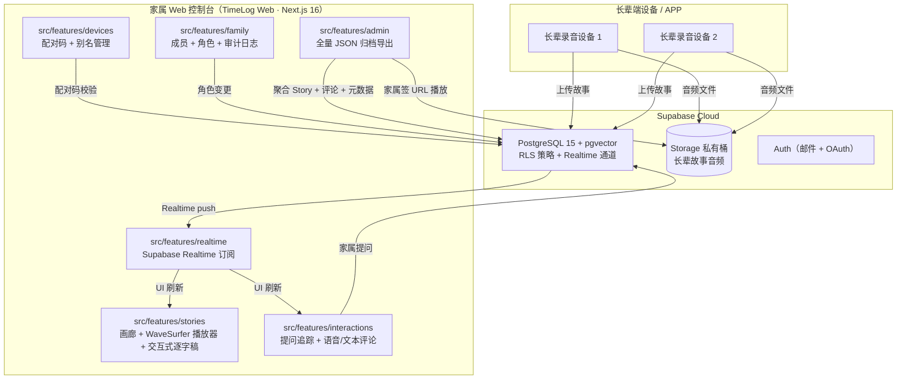
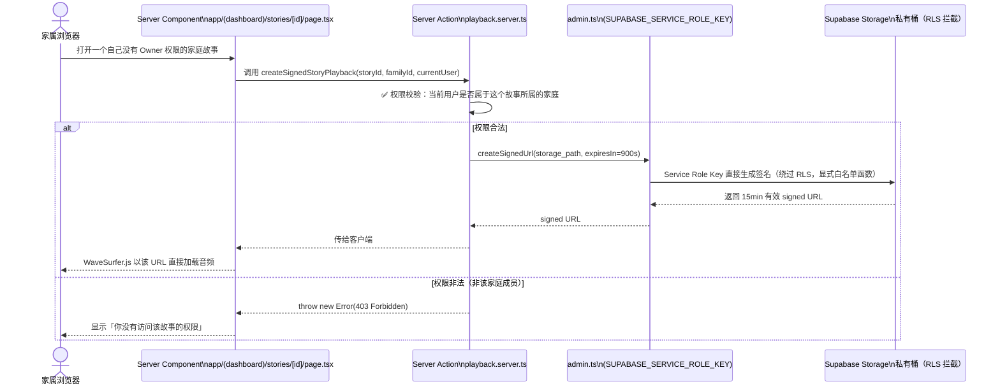

# TimeLog Web 🕰️

<p align="center">
  <strong>跨代家庭故事留存与治理的 Web 控制台 · 长辈录音 + 家庭互动 + 语义检索</strong>
</p>

<p align="center">
  <a href="https://github.com/MeiSiristhebest/timelog-web/actions/workflows/ci.yml"></a>
  <a href="https://app.netlify.com/sites/timelog-web/deploys"></a>
  <a href="https://github.com/MeiSiristhebest/timelog-web/blob/master/LICENSE"></a>
  
  
  
  
  
  <a href="DESIGN.md"></a>
</p>

---

<p align="center">
  <a href="README.md">🇨🇳 中文</a> &nbsp;·&nbsp; <a href="README_EN.md">🇺🇸 English</a>
</p>

---

## 📖 About

TimeLog Web 是 TimeLog 分布式家庭记忆系统的**中央治理与语义富化 Web 控制台**。

**核心问题场景**：在中国「数字反哺」普遍缺位的背景下，很多老人拥有丰富的人生故事，但子女常年在外、三代同住较少——家庭共同故事在口耳相传中快速流失，文字记录太难坚持，传统相册缺乏语义检索与互动性。长辈端设备录制的故事音频散落在本地，家属无法统一管理、回放与互动。

**TimeLog Web 的定位**：作为家属端的统一治理入口，把长辈端硬件/APP 录制的故事音频、AI 自动转写文本、pgvector 语义索引，集中在一个控制台管理，实现：

1. 统一浏览与播放全家的故事档案
2. 家属向长辈发送引导性提问（反向触发长辈新的录音）
3. 文本 + 语音评论互动，按家庭成员做角色区分
4. 语义检索：用一句话在全家故事库里搜相关段落
5. 全量数据主权 JSON 导出，不被平台锁定
6. 设备配对与角色管理（家庭成员权限 / 多设备别名）
7. 英 / 中 / 泰三语国际化，面向多语言跨代家庭
8. WCAG 2.2 AAA 高对比度无障碍视觉系统 —— 「听音室」的沉浸式体验

> **为什么要造一个新的而不是用现成的家庭相册类产品？** 因为市面上的家庭相册产品（如 Google Photos / 微信家庭相册）普遍只解决「照片存储」，对**长音频**的支持很差：没有逐字稿与音频同步高亮、没有基于语义的故事检索、没有基于 RLS 的细粒度家庭成员权限隔离、也没有「家属提问 → 长辈录音 → 家属评论」的反向互动闭环。TimeLog 的整套架构（Supabase RLS + Admin 端签名 URL 旁路 + pgvector 语义检索）就是为了填补这个工程空白。

---

## ✨ Key Features

| # | Feature | 核心实现 | Contextual Note |
|---|---------|---------|-----------------|
| 1 | **🎙️ 安全音频流式播放**（RLS 旁路） | 音频存在 Supabase Storage 私有桶；家属非音频 Owner，直接访问会被 RLS 拦截。服务端用 `SUPABASE_SERVICE_ROLE_KEY` 初始化 Admin 客户端，按家庭 ID 做权限校验后调用 `createSignedUrl` 生成限时签名播放 URL，返回给客户端 WaveSurfer.js 渲染。 | ⚠️ 签名 URL 默认有效期 15min，避免泄露风险。播放超时会自动触发客户端重签。 |
| 2 | **💬 双向互动：提问 + 语音/文本评论** | `prompts-tracker.tsx` 实时追踪「发给长辈的引导提问」状态（等待录音 / 已录音 / 已过期）；Web Audio API 浏览器端录音上传至 Supabase，支持语音评论。 | 引导性提问模板库：预设"小时候最喜欢玩什么？""第一次做爸爸/妈妈是什么感觉？"等 30+ 场景化问题。 |
| 3 | **🔑 免密设备配对 + 别名管理** | 配对码一次性短码建立设备与家庭账户的关联；家属端可在 Web 控制台给绑定的设备改名（如「外婆的话匣子」「爷爷的故事机」），便于多设备管理。 | 兼容长辈端硬件 / APP（Android / iOS），不需要长辈输入账号密码。 |
| 4 | **🔍 pgvector 语义检索** | 故事逐字稿以 embedding 向量存入 PostgreSQL `pgvector` 扩展；家属控制台搜索框一句话查询即可召回最相关的故事段落。 | 使用 `text-embedding-3-small` 或 Open-Source Embedding（v0.2 可切换）。 |
| 5 | **🌐 零延迟三语国际化（EN / ZH / TH）** | `next-intl` 全站国际化，所有硬编码字符串均提取到 `messages/{en,zh,th}.json`；Server Actions 的错误提示、动态日期格式化全部跟随当前 Locale。 | 语言选择器在登录页与控制台均有入口，切换无刷新。 |
| 6 | **🎨 WCAG 2.2 AAA 无障碍 + 「听音室」视觉主题** | 深黑（#11100d Obsidian）+ 浅羊（#f4efe6 Parchment）+ 金沙（#d4b67a Sand）双色调；双字型系统（Cormorant Garamond 衬线 + Instrument Sans 无衬线）；所有交互焦点环 3:1+ 高对比。 | 详见 [DESIGN.md](DESIGN.md)。 |
| 7 | **📄 数据主权与全量 JSON 归档导出** | `export-actions.ts` Server Action 一键聚合：家庭故事、逐字稿、所有评论、媒体元数据，打包为结构化 JSON Archive 文件供下载。 | 完全符合 GDPR 数据可携带权。未来可导入回另一台 TimeLog 自托管实例。 |
| 8 | **📡 Supabase Realtime 实时同步** | 长辈端新录音、家属新发评论或点赞 → Supabase Realtime 订阅 Postgres 变更 → 家属 Web 端 `subscriptions.ts` 秒级刷新。 | 支持页面 tab 切换后的自动重连与断点续接。 |
| 9 | **📜 审计日志** | 家庭成员、设备变更、角色调整、导出动作均写入 PostgreSQL Audit Logs，控制台「审计日志」页支持按时间与操作人筛选。 | 管理员角色独有访问权限。 |

---

## ⚙️ Requirements

| Prerequisite | Minimum Version | 说明 |
|-------------|-----------------|------|
| **Node.js** | **20.19.0**（严格对齐 `.node-version` / `.nvmrc`） | 生产用 `.node-version` 20.19；Netlify 构建目前用 20.18（见 `netlify.toml`），建议后续统一升级到 20.19 |
| **pnpm** | ≥ **10.33.0**（严格对齐 `package.json` `engines.pnpm`） | `corepack enable && corepack prepare pnpm@10.33.0 --activate` |
| **Supabase Project** | — | 一个 Supabase 项目（Free Plan 起步即可），需要：PostgreSQL 实例、Storage、Auth、Realtime、pgvector 扩展 |
| **浏览器** | Chrome 110+ / Safari 16.4+ / Edge 110+ / Firefox 113+ | WaveSurfer.js 音频播放需要 Web Audio API；i18n 用了 Intl APIs |
| **（可选）Netlify 账户** | — | 一键部署；若不用 Netlify 可部署到 Vercel（需要把 Supabase 环境变量同样配置到 Vercel Project） |

---

## 📦 Installation

### Step 1：Clone + 装依赖

```bash
git clone https://github.com/MeiSiristhebest/timelog-web.git
cd timelog-web

# Corepack 对齐 pnpm 版本与锁版本一致，强烈建议
corepack enable
corepack prepare pnpm@10.33.0 --activate

# 安装依赖（pnpm-lock.yaml 冻结；~500MB node_modules）
pnpm install --frozen-lockfile
```

### Step 2：配置 Supabase 项目 + .env

在仓库根目录创建 `.env.local`（Next.js 标准命名），填入以下 Supabase 环境变量：

```env
# ============================================================
# Supabase — 所有三个必填，缺一不可
# 在 Supabase 控制台 → Project → Settings → API 里获取
# ============================================================

# ① 客户端匿名 Key（可暴露给浏览器）：anon public key
NEXT_PUBLIC_SUPABASE_URL="https://xxxxxxxxxxxx.supabase.co"
NEXT_PUBLIC_SUPABASE_ANON_KEY="eyJhbGciOiJIUzI1NiIsInR5cCI6IkpXVCJ9......"

# ② 服务端 Service Role Key（★★★ 绝对不可提交 Git / 暴露给浏览器 ★★★）
# 用于：admin.ts 绕过 RLS 生成家属播放的签名 URL + 审计日志写入 + pgvector embedding 写回
SUPABASE_SERVICE_ROLE_KEY="eyJhbGciOiJIUzI1NiIsInR5cCI6IkpXVCJ9......"

# ============================================================
# NextAuth / Next.js Runtime（可选，建议填）
# ============================================================

# 生成方式：openssl rand -hex 32
NEXTAUTH_SECRET="your-64-char-hex-secret"
# 生产写真实域名；本地开发默认 http://localhost:3000 可省略
NEXTAUTH_URL="http://localhost:3000"
```

> 🚨 **关于 Service Role Key 的使用边界**：代码中的 `src/lib/supabase/admin.ts` 是**唯一允许使用 `SUPABASE_SERVICE_ROLE_KEY` 的模块**，其他所有 client/server 模块都只允许使用 anon key。任何绕过 RLS 的操作必须在 admin.ts 里显式写白名单函数（目前有 `createSignedStoryPlayback`），严禁在页面或 action 里直接 `new SupabaseClient(url, SERVICE_ROLE)` 全开权限。

### Step 3：Supabase 数据初始化（SQL 脚本）

仓库根目录已经准备好了**一套可直接运行的 SQL 脚本**，按顺序在 Supabase SQL Editor 中执行：

```bash
# 打开 Supabase → SQL Editor → New Query，按顺序粘贴运行：
#
# ① 基础角色与 RLS 设定（初始账号管理）
psql <your-pg-conn-string> < supabase-role-management.sql
#
# ② Admin Setup（pgvector 扩展、表结构、RLS 策略脚手架）
psql <your-pg-conn-string> < supabase-admin-setup.sql
#
# ③ 修复常见的 RLS 策略（家庭成员可见范围 / 音频文件权限）
psql <your-pg-conn-string> < supabase-fix-rls.sql
#
# ④ 快速管理员创建（方便本地开发直接登录管理员账号）
psql <your-pg-conn-string> < supabase-quick-admin.sql
#
# ⑤ （如需）简化角色体系，降低复杂度
psql <your-pg-conn-string> < simplify-roles.sql
```

> 本地开发遇到 RLS 权限问题或家庭关联问题时，可以先用仓库里的 diagnose 脚本自查：
> `diagnose-family-rls.sql`（检查家庭成员 RLS 绑定）与 `diagnose-auth-profiles.sql`（检查 Auth Profiles 同步），根据诊断输出再用 `fix-*.sql` 修复。

### Step 4：i18n 语言文件存在性校验

三语 JSON 文件必须都存在，否则 `next-intl` 会在启动时抛错：

```bash
ls -la messages/
# 必须输出：en.json  zh.json  th.json
# 如果缺失 → 从其他语言文件复制一份再翻译
```

---

## 🚀 Quick Start（5 分钟端到端验证）

> 前提：Installation → Step 1~4 全部完成，Supabase 项目可正常连接。

### Step 1：启动开发服务器

```bash
# 默认 Turbopack 加速（Next.js 16）
pnpm dev
# 等价于 next dev --turbopack → http://localhost:3000

# （备选）如果 Turbopack 在你的环境有兼容性问题，走 Webpack：
pnpm dev:webpack
```

### Step 2：跑全量质量门禁（lint + typecheck + test + build），确保 CI 也能过

```bash
pnpm check
# 等价于 pnpm lint && pnpm typecheck && pnpm test && pnpm build
# 期望全部 pass（lint 0 warnings，typecheck 0 errors，Vitest 全部 ✓，next build 成功）
```

### Step 3：浏览器端到端验证

1. 浏览器打开 `http://localhost:3000`
   - 视觉：顶部语言切换器（EN/中/TH）可点；整体视觉呈现「深黑 + 金沙 + 羊皮纸」色调
2. 点「注册 / 登录」→ 用刚才 `supabase-quick-admin.sql` 创建的管理员账号登录
3. 进入「故事画廊」：如果长辈端有演示录音已经导入 → 可看到卡片列表；否则为空也正常
4. 进入「设备管理」→「新增设备」：
   - 生成 6 位配对码 → 模拟长辈端录入（本地开发没有硬件可用 Postman 调接口）
   - 配对成功后，可在「设备别名」输入框改名为「外婆的话匣子」
5. 进入「家庭成员」：邀请一个新成员（可用不同邮箱注册）→ 设为「普通家属」角色
6. 进入「审计日志」：确认刚才的操作（登录、改名、邀请）都已留有记录
7. **无障碍自检**：在浏览器控制台 → Lighthouse → Accessibility 扫描，目标 ≥ **98 分（WCAG 2.2 AAA）**

### Step 4：Vitest 单测验证（可选，想更放心）

```bash
pnpm test
# Vitest 终端输出 Test Files X passed | Tests Y passed
# 覆盖率 ≥ 60%（首次开发阶段目标；长期目标 80%）
```

---

## 🏗️ Architecture Highlights

### 1. 中央治理 & 实时同步（Central Governance + Realtime）



**核心源码入口**：
- [subscriptions.ts（Realtime 订阅：故事列表 / 评论 / 点赞状态）](src/features/realtime/subscriptions.ts)
- [page.tsx（故事画廊，SSR + force-dynamic 绕过静态缓存）](src/app/(dashboard)/stories/page.tsx)
- [queries.ts（故事查询 + 语义检索 pgvector 包装）](src/features/stories/queries.ts)

---

### 2. 安全音频播放 & RLS 旁路（Admin Signed URL Pattern）



**核心源码入口**：
- [admin.ts（Supabase Admin 客户端 · 唯一允许 Service Role Key 的模块）](src/lib/supabase/admin.ts)
- [playback.server.ts（服务端签名 URL 生成，含家庭成员权限校验逻辑）](src/features/stories/playback.server.ts)
- [waveform-player.tsx（WaveSurfer.js 播放器，与交互式逐字稿毫秒级同步高亮）](src/features/stories/components/playback-room/waveform-player.tsx)
- [interactive-transcript.tsx（逐字稿滚动 + 播放位置同步高亮）](src/features/stories/components/playback-room/interactive-transcript.tsx)

---

## 📂 Project Structure（Feature-Based 高内聚目录）

```text
timelog-web/
├── .github/
│   └── workflows/
│       └── ci.yml                         # GitHub Actions：ESLint + TSC + Vitest + Build
├── messages/                               # i18n 三语 JSON（硬编码字符串的唯一来源）
│   ├── en.json                             # 🇺🇸 English
│   ├── zh.json                             # 🇨🇳 中文
│   └── th.json                             # 🇹🇭 ไทย
├── public/                                 # og:image / favicon / 静态演示音频（公开）
├── src/
│   ├── app/                                # Next.js 16 App Router（页面路由）
│   │   ├── (auth)/                         # 登录 / 注册 / 忘记密码（NextAuth）
│   │   ├── (dashboard)/                    # 登录后控制台
│   │   │   ├── stories/                    #   · 故事画廊 + 播放详情页
│   │   │   ├── devices/                    #   · 设备配对与别名管理
│   │   │   ├── family/                     #   · 家庭成员角色管理
│   │   │   ├── audit/                      #   · 审计日志
│   │   │   ├── search/                     #   · pgvector 语义检索结果
│   │   │   └── settings/                   #   · 偏好设置（语言、主题、通知）
│   │   └── api/                            #   · 调试 API、音频播放（SSR 代理）
│   ├── components/                         # 跨 Feature 共享组件
│   │   ├── admin/                          # 管理员专属组件（导出按钮、审计筛选器）
│   │   ├── dashboard/                      # 通用顶栏、侧栏、空状态、卡片
│   │   ├── layout/                         # Layout 组件（侧边导航、LanguageSelector 等）
│   │   └── ui/                             # 基于 Radix + Tailwind 的无障碍组件（Button/Dialog/Tabs...）
│   ├── contexts/                           # 全局 Context：AuthContext（用户+家庭）
│   ├── features/                           # ★ 按业务领域高内聚（Feature-Based 架构）
│   │   ├── admin/                          # export-actions.ts 全量 JSON 归档导出
│   │   ├── audit/                          # 审计日志查询 + 分页
│   │   ├── devices/                        # 配对表单、别名、状态、queries/actions
│   │   ├── family/                         # 成员邀请、角色变更、queries/actions
│   │   ├── interactions/                   # 引导提问追踪器、评论（语音/文本）发送
│   │   ├── realtime/                       # Supabase Realtime 订阅统一入口
│   │   └── stories/                        # 画廊、WaveSurfer 播放、逐字稿、点赞、导出
│   ├── hooks/                              # 共享 React Hooks（useTranslation...）
│   ├── i18n/                               # next-intl 配置（Locale 路由/消息）
│   ├── lib/                                # 底层库封装
│   │   └── supabase/
│   │       ├── client.ts                   # 客户端 SupabaseClient（anon key）
│   │       ├── server.ts                   # 服务端 RSC / Action（anon key）
│   │       ├── admin.ts                    # ★★★ Service Role Key，仅限 白名单函数调用 ★★★
│   │       └── env.ts                      # 环境变量 zod 校验
│   └── types/                              # 全局 TS：Story / Prompt / Comment / FamilyMember
├── AGENTS.md                               # AI Coding Agent（Agent 行为约束）
├── CLAUDE.md                               # Claude Code 开发指令（架构模式、代码风格、命令）
├── DESIGN.md                               # 完整设计系统规范（色板、字型、间距、WCAG 2.2 AAA 检查项）
├── GEMINI.md                               # 开发纪实与变更日志
├── LICENSE                                 # （若缺失请补充 MIT）
├── DESIGN.md                               # 设计系统规范
├── GEMINI.md                               # 开发纪实
├── middleware.ts                           # Next.js 中间件（鉴权、i18n locale 重写）
├── next.config.ts                          # Next.js 配置
├── netlify.toml                            # Netlify Deploy Config（构建命令、Node 版本、Env 注入）
├── eslint.config.mjs                       # ESLint 9 配置
├── package.json                            # engines.node=20.x, pnpm≥10.33 + 脚本命令
├── performance-budget.json                 # Lighthouse CI 性能预算（首屏 JS < 200KB）
├── pnpm-lock.yaml                          # 锁版本
├── postcss.config.mjs                      # Tailwind v4 PostCSS 配置
├── tsconfig.json                           # TS Strict Mode（strict: true）
├── cleanup-test-data.sql                   # 开发后清理测试数据 SQL
├── diagnose-family-rls.sql                 # RLS 诊断
├── diagnose-auth-profiles.sql              # Auth Profiles 同步诊断
├── fix-family-members-rls.sql              # 修复家庭成员 RLS 绑定
├── fix-auth-profiles-sync.sql              # 修复 Auth Profiles 同步
├── complete-auth-profiles-sync.sql         # Auth Profiles 全量同步（一次性）
├── simplify-roles.sql                      # 简化角色体系（可选）
├── supabase-admin-setup.sql                # 初始化表结构 + pgvector + RLS
├── supabase-fix-rls.sql                    # RLS 策略修复
├── supabase-role-management.sql            # 角色管理 SQL
└── supabase-quick-admin.sql                # 快速创建本地管理员账号
```

---

## 🛠️ Development Commands（SOP）

```bash
# 开发服务器（Turbopack）
pnpm dev                      # 端口 3000

# 暴露到局域网（长辈端调试回调 / 手机端访问）
pnpm dev:host                 # 0.0.0.0:3000

# 生产构建 + 本地启动
pnpm build && pnpm start

# 代码质量
pnpm lint                     # ESLint 9（max-warnings=0）
pnpm typecheck                # TypeScript 6 strict（--noEmit）
pnpm test                     # Vitest 单元 + 集成测试
pnpm check                    # 🔒 一条龙：lint → typecheck → test → build（等同于 CI 门禁）

# 格式化（ESLint 负责格式化）
pnpm lint --fix
```

---

## 🤝 Contributing

我们正在完善贡献指南。首次贡献前请优先阅读：

- [CLAUDE.md（开发者架构 + 代码风格 + 命令速查）](CLAUDE.md)
- [AGENTS.md（AI Agent 行为约束）](AGENTS.md)
- [DESIGN.md（视觉系统 + 无障碍合规要求）](DESIGN.md)
- [GEMINI.md（开发纪实 · 了解项目演进脉络）](GEMINI.md)

**快速三步提 PR**：

```bash
# 1. Fork → Clone → 切分支（建议 feat/support-xxx 或 fix/issue-xxx）
git checkout -b feat/support-french-i18n

# 2. 修改代码后通过完整质量门禁
pnpm check
# lint ✓ · typecheck ✓ · test ✓ · build ✓

# 3. Commit（建议 Conventional Commits：feat/fix/docs/chore/refactor）
git commit -m "feat(i18n): add French language messages and locale FR"
git push origin feat/support-french-i18n
# 然后在 GitHub 提 PR 到 master 分支
```

**急需贡献 / Good First Issue**：

- 🆕 更多语言（日语、韩语、西班牙语……）：只需把 `messages/en.json` 复制为 `messages/ja.json` 并翻译，`next-intl` 自动识别
- 🧪 Vitest 单测：目前有骨架，欢迎补 features/stories 和 features/family 的单测
- 🧩 无障碍细节：欢迎用 axe-core 扫描后提 PR 修复任何 AA/AAA 的小问题

---

## 🔒 Security

### 已知的高风险点 & 对应防护

| 风险场景 | 防护措施 |
|---------|---------|
| **Service Role Key 泄露**（绕过 RLS 可读写全库） | ① `.env.local` 加入 `.gitignore`（已加）；② `admin.ts` 是唯一入口；③ Netlify / Vercel 环境变量面板单独设置，不写在 `.env` 提交 |
| **家属拿到签名 URL 后二次分享**（泄露长辈音频） | 签名 URL 默认 900s（15 分钟）有效期；可在 `playback.server.ts` 进一步缩短到 300s；未来计划增加 IP 绑定 + UA 指纹校验 |
| **RLS 策略误配导致跨家庭可见** | 所有表默认启用 RLS；修改策略前必须先跑 `diagnose-family-rls.sql` + `diagnose-auth-profiles.sql`；PR 合入前要求贴 RLS 单元测试结果 |
| **NextAuth Session 劫持** | `NEXTAUTH_SECRET` 建议 64 字符 hex；生产强制 HTTPS + Secure Cookie + SameSite=Lax |
| **长辈端配对码暴力破解** | 配对码 10 分钟 5 次错误锁定 + Supabase RPC 计数；错误日志写入审计日志 |
| **全量归档导出泄露** | 仅管理员（owner）角色可执行；导出动作 100% 记入审计日志（时间、操作人、导出数据量） |

### 漏洞上报

发现安全漏洞（特别是 RLS 绕过、签名 URL 权限提升、或 `SUPABASE_SERVICE_ROLE_KEY` 在客户端代码痕迹）**请不要公开在 Issue**，直接发邮件至：**`timelog-security [at] googlegroups [dot] com`**。

承诺 24 小时内首次响应，高危漏洞 72 小时内发布修复补丁（Hotfix + Netlify Redploy），确认修复后公开致谢。

---

## 🚀 Deployment（Netlify 一键部署）

仓库已配置好 [`netlify.toml`](netlify.toml)，不需要改任何构建配置，只需：

1. 在 Netlify → Add new site → Import existing project → 选择本仓库
2. 在 Netlify → Site → Site settings → Environment variables 中**逐一配置以下 4 个变量**（与 `.env.local` 对应）：
   - `NEXT_PUBLIC_SUPABASE_URL`
   - `NEXT_PUBLIC_SUPABASE_ANON_KEY`（Supabase 项目 → Project Settings → API → `anon` `public` key，必须带 `NEXT_PUBLIC_` 前缀，浏览器端可暴露）
   - `SUPABASE_SERVICE_ROLE_KEY`（★ 设为 Sensitive，绝不要勾选 "Redeploy all Prev Deploys" 暴露旧版本）
   - `NEXTAUTH_SECRET`（`openssl rand -hex 32`）
3. 点击「Deploy site」→ 首次构建大约 2~4 分钟（pnpm install frozen lockfile + next build）
4. 构建成功后分配一个默认的 `xxx.netlify.app` 子域；建议绑定自定义域名（如 `timelog.yourdomain.com`）并启用 Netlify Full（Strict）SSL

> 部署 Vercel：同样支持，只需把同样的 4 个环境变量配到 Vercel Project Settings → Environment Variables 即可（与 @supabase/ssr 官方 Next.js SSR 示例命名完全一致）。

---

## 📄 License

TimeLog Web 基于 **MIT License** 开源。

- ✅ 商用自由（自托管、或作为服务的一部分部署给客户家庭）
- ✅ 修改自由、重新分发自由（闭源或开源均可）
- ❌ 作者对于直接/间接使用产生的数据损失、长辈隐私泄露等后果不承担任何责任（请务必按 🔒 Security 章节加固 RLS + Key）

**版权声明**：Copyright (c) 2025–2026 TimeLog Web Contributors. All Rights Reserved.

完整许可证原文请参阅仓库根目录下的 [`LICENSE`](LICENSE) 文件。

---

<p align="center">
  <em>Made with ❤️ for the Senior Project · WCAG 2.2 AAA Accessibility Standard for Elders</em>
</p>
