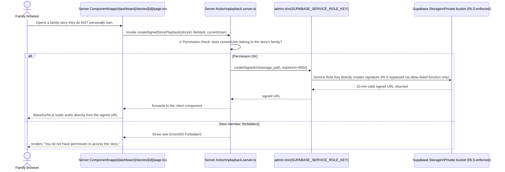

# TimeLog Web 🕰️

<p align="center">
  <strong>Cross-Generational Family Story Preservation & Governance Console — Elder voice capture + family interaction + semantic retrieval</strong>
</p>

<p align="center">
  <a href="https://github.com/MeiSiristhebest/timelog-web/actions/workflows/ci.yml"></a>
  <a href="https://app.netlify.com/sites/timelog-web/deploys"></a>
  <a href="https://github.com/MeiSiristhebest/timelog-web/blob/master/LICENSE"></a>
  
  
  
  
  
  <a href="DESIGN.md"></a>
</p>

---

<p align="center">
  <a href="README.md">🇨🇳 中文</a> &nbsp;·&nbsp; <a href="README_EN.md">🇺🇸 English</a>
</p>

---

## 📖 About

**TimeLog Web** is the **central governance & semantic-enrichment web console** for the distributed TimeLog family-memory system.

**The problem it solves:** In many markets where elders are the primary custodians of family oral history (particularly the Chinese "digital reverse-onboarding" context), grown-up children live far away, three-generation households are rare — and shared family stories evaporate quickly when transmitted only by word of mouth. Writing things down is too hard to sustain; traditional photo albums lack semantic search and interactivity. Audio stories captured on the elder-facing hardware / apps end up siloed and unmanageable for the rest of the family.

**What TimeLog Web does:** Provides a unified **family-governance console** that ingests elder-recorded story audio, AI-generated transcripts, and pgvector semantic indexes into one place — enabling:

1. Unified browsing and playback of the entire family story archive.
2. Family members sending **guided questions** back to elders to trigger new recordings.
3. Text + voice **comments and reactions**, role-segregated by family member.
4. **Semantic search** across the full-family story corpus using plain-language queries.
5. Full **data-portability** JSON archive export so you never get locked in.
6. Device pairing and role management (family-member permissions / multi-device aliases).
7. Trilingual internationalisation (EN / ZH / TH) for multilingual cross-generational households.
8. A **WCAG 2.2 AAA high-contrast accessible visual system** + an immersive "Listening Room" theme.

> **Why build a new product instead of using a generic family album?** Because every off-the-shelf family album (Google Photos / WeChat Family Album / etc.) is optimised for photos and handles **long-form audio** poorly: no transcript-audio synchronous highlighting, no semantic story retrieval, no RLS-backed fine-grained family permission isolation — and no closed "family question → elder records → family comments" interaction loop. TimeLog's whole architecture (Supabase RLS + admin signed-URL bypass + pgvector semantic retrieval) exists specifically to fill that engineering gap.

---

## ✨ Key Features

| # | Feature | How it works | Contextual Note |
|---|---------|-------------|-----------------|
| 1 | **🎙️ Secure audio streaming (RLS bypass pattern)** | Audio lives in a private Supabase Storage bucket; non-owner family members would normally be blocked by RLS. The server initialises an **admin SupabaseClient** using `SUPABASE_SERVICE_ROLE_KEY`, validates access by family ID, then calls `createSignedUrl` to produce a time-limited signed playback URL that WaveSurfer.js renders. | ⚠️ Default signed-URL TTL is **15 minutes** (900 s) to limit leakage risk; the client auto-refreshes the signature when playback times out. |
| 2 | **💬 Bidirectional interaction: guided questions + voice/text comments** | `prompts-tracker.tsx` live-tracks guided questions sent to elders (awaiting recording / recorded / expired). Browser-side Web Audio API captures voice comments that upload straight to Supabase. | 30+ scene-specific guided-question templates ship with the product (e.g. *"What did you love to play at as a child?"*, *"How did it feel the first time you became a parent?"*). |
| 3 | **🔑 Passwordless device pairing + friendly aliases** | One-time short pairing codes bind an elder device to the family account. Family members rename the device in the web console (e.g. *"Grandma's Voicebox"*, *"Grandpa's Story Machine"*) for multi-device sanity. | Compatible with elder-facing hardware / apps (Android / iOS). Elders never need to type a password. |
| 4 | **🔍 pgvector semantic search** | Story transcripts are embedded into PostgreSQL via the `pgvector` extension. A single plain-language query in the family search box returns the most semantically relevant story passages. | Uses `text-embedding-3-small` by default; swappable with open-source embedding backends in v0.2. |
| 5 | **🌐 Zero-refresh trilingual i18n (EN / ZH / TH)** | `next-intl` drives the whole app. All hard-coded strings live in `messages/{en,zh,th}.json`; Server Action error messages and dynamic date formatting all follow the active locale. | Language switcher exists on both the login and console pages; switching languages does not reload the page. |
| 6 | **🎨 WCAG 2.2 AAA accessibility + "Listening Room" visual theme** | Deep Obsidian (`#11100d`) + soft Parchment (`#f4efe6`) + warm Sand (`#d4b67a`) duotone palette; paired Cormorant Garamond serif / Instrument Sans sans typography system; every interactive focus ring hits ≥ 3:1 contrast. | See [DESIGN.md](DESIGN.md) for the full design-system spec. |
| 7 | **📄 Data sovereignty — full-JSON archive export** | `export-actions.ts` (a Server Action) aggregates every family story, transcript, comment, and piece of media metadata into a single structured JSON archive for download. | Compliant with the GDPR right to data portability. Archives produced today are intended to be importable into a self-hosted TimeLog instance tomorrow. |
| 8 | **📡 Supabase Realtime live sync** | New elder recordings, family comments, and likes — all flow through Supabase Realtime subscriptions to Postgres change events. `subscriptions.ts` on the web side refreshes the UI sub-second. | Automatic tab-suspended reconnect with resume-from-last-seen-offset. |
| 9 | **📜 Audit logging** | Family membership changes, device pairings, role adjustments, and export actions are all written into PostgreSQL audit logs; admins can filter by operator + timestamp in the Audit page. | Restricted to the admin role only. |

---

## ⚙️ Requirements

| Prerequisite | Minimum Version | Notes |
|-------------|-----------------|-------|
| **Node.js** | **20.19.0** (strictly matches `.node-version` / `.nvmrc`) | Production uses `.node-version` = 20.19; Netlify builds currently pin a 20.18 build image in `netlify.toml` — please align to 20.19 when Netlify ships it. |
| **pnpm** | ≥ **10.33.0** (strictly matches `engines.pnpm` in `package.json`) | `corepack enable && corepack prepare pnpm@10.33.0 --activate` |
| **Supabase project** | — | One Supabase project (start on the Free Plan) with: PostgreSQL instance, Storage, Auth, Realtime, and the `pgvector` extension enabled. |
| **Web browser** | Chrome 110+ / Safari 16.4+ / Edge 110+ / Firefox 113+ | WaveSurfer.js playback relies on Web Audio API; i18n uses `Intl.*` APIs. |
| **(Optional) Netlify account** | — | One-click deploys. If you skip Netlify, deployment to Vercel is supported (copy the same Supabase env vars into Vercel Project Settings). |

---

## 📦 Installation

### Step 1 · Clone & install dependencies

```bash
git clone https://github.com/MeiSiristhebest/timelog-web.git
cd timelog-web

# Strongly recommended: pin pnpm to the exact locked version with Corepack
corepack enable
corepack prepare pnpm@10.33.0 --activate

# Install all deps frozen by pnpm-lock.yaml (~ 500 MB node_modules)
pnpm install --frozen-lockfile
```

### Step 2 · Provision a Supabase project + fill in `.env.local`

Create `.env.local` (Next.js standard name) at the repo root with the following Supabase env vars:

```env
# ============================================================
# Supabase — ALL THREE are mandatory — all three must be filled in
# Get values from: Supabase Dashboard → Your Project → Settings → API
# ============================================================

# ① Client-side anonymous key (SAFE to expose to the browser): anon public key
NEXT_PUBLIC_SUPABASE_URL="https://xxxxxxxxxxxx.supabase.co"
NEXT_PUBLIC_SUPABASE_ANON_KEY="eyJhbGciOiJIUzI1NiIsInR5cCI6IkpXVCJ9......"

# ② Server-side SERVICE ROLE KEY (★★★ NEVER commit to Git / expose to the browser ★★★)
# Used exclusively by: admin.ts to bypass RLS for:
#   • creating signed playback URLs for non-owner family members
#   • writing audit logs
#   • writing pgvector embeddings back to Postgres
SUPABASE_SERVICE_ROLE_KEY="eyJhbGciOiJIUzI1NiIsInR5cCI6IkpXVCJ9......"

# ============================================================
# NextAuth / Next.js runtime (optional but strongly recommended)
# ============================================================

# Generate with: openssl rand -hex 32
NEXTAUTH_SECRET="your-64-char-hex-secret"
# Set to your real production domain; local dev http://localhost:3000 can be omitted
NEXTAUTH_URL="http://localhost:3000"
```

> 🚨 **Service Role Key boundary rule:** `src/lib/supabase/admin.ts` is the **only module in the entire codebase** allowed to import `SUPABASE_SERVICE_ROLE_KEY`. Every other client/server module must use the anon key client. Every RLS-bypassing operation must be an explicitly allow-listed function inside `admin.ts` (currently only `createSignedStoryPlayback`). Never write `new SupabaseClient(url, SERVICE_ROLE)` directly inside a page or a Server Action.

### Step 3 · Initialise Supabase with the bundled SQL scripts

A suite of production-ready SQL scripts ships at the repo root. Run them **in order** in the Supabase SQL Editor:

```bash
# Navigate to: Supabase → SQL Editor → New Query, then paste and run:
#
# ① Baseline roles + RLS configuration (account scaffolding)
psql <your-pg-conn-string> < supabase-role-management.sql
#
# ② Admin setup (pgvector extension, tables, RLS policy scaffolding)
psql <your-pg-conn-string> < supabase-admin-setup.sql
#
# ③ Fix common RLS holes (family visibility range / audio object permissions)
psql <your-pg-conn-string> < supabase-fix-rls.sql
#
# ④ Quick-admin create (for local dev: a ready-to-login admin account)
psql <your-pg-conn-string> < supabase-quick-admin.sql
#
# ⑤ (Optional) Role simplification if you want less architectural surface area
psql <your-pg-conn-string> < simplify-roles.sql
```

> When debugging RLS permission issues or family-linking problems in local dev, run the diagnostic scripts first:
> `diagnose-family-rls.sql` (checks family-RLS bindings) and `diagnose-auth-profiles.sql` (checks Auth ↔ Profiles sync). Use the printed diagnostics to pick the right `fix-*.sql` patch.

### Step 4 · Sanity-check the trilingual i18n JSON files

All three JSON files must be present or `next-intl` throws on boot:

```bash
ls -la messages/
# Expected: en.json  zh.json  th.json
# If any is missing → copy another language JSON as a template and translate it.
```

---

## 🚀 Quick Start · end-to-end in 5 minutes

> Prerequisites: Installation → Steps 1–4 all completed successfully; Supabase project is reachable.

### Step 1 · Start the dev server

```bash
# Default Turbopack accelerator (Next.js 16)
pnpm dev
# Equivalent to: next dev --turbopack → opens on http://localhost:3000

# (Fallback) If Turbopack has compatibility issues on your machine, use Webpack:
pnpm dev:webpack
```

### Step 2 · Run the full quality gate (lint + typecheck + test + build) — identical to CI

```bash
pnpm check
# Expands to: pnpm lint && pnpm typecheck && pnpm test && pnpm build
# Expectation: lint 0 warnings · typecheck 0 errors · Vitest all green · next build successful
```

### Step 3 · Browser smoke test end-to-end

1. Open `http://localhost:3000`
   - The top language switcher (EN/中文/TH) should be clickable; the palette should render "Obsidian + Sand + Parchment".
2. Click **Sign up / Sign in** → log in with the admin account that `supabase-quick-admin.sql` created.
3. Open **Story Gallery**:
   - If you already imported demo elder recordings you'll see populated cards; an empty state is perfectly fine too.
4. Open **Device Management → Add Device**:
   - Generate a 6-digit pairing code → simulate the elder side posting it (local dev without hardware: use Postman to hit the pairing RPC).
   - After successful pairing rename it to a friendly alias like "Grandma's Voicebox".
5. Open **Family Members**: invite a new user (use a different email) and role them "regular family member".
6. Open **Audit Logs**: confirm the login, rename, and invite rows were written.
7. **Accessibility self-check:** Browser DevTools → Lighthouse → Accessibility scan — target score ≥ **98 (WCAG 2.2 AAA)**.

### Step 4 · (Optional, for extra confidence) Vitest unit test run

```bash
pnpm test
# Terminal output: Test Files X passed | Tests Y passed
# Coverage target ≥ 60 % (early-stage ambition; long term target 80 %).
```

---

## 🏗️ Architecture Highlights

### 1. Central governance & realtime sync

```mermaid
graph TD
    subgraph Devices [Elder-facing hardware / apps]
        D1[Elder recording device 1]
        D2[Elder recording device 2]
    end

    subgraph SupabaseCloud [Supabase Cloud]
        PG[PostgreSQL 15 + pgvector\nRLS policies + Realtime channels]
        STO[(Storage private bucket\nElder story audio files)]
        AUTH[Auth (Email + OAuth)]
    end

    subgraph WebConsole [Family Web Console (TimeLog Web · Next.js 16)]
        RT[src/features/realtime\nSupabase Realtime subscriptions]
        STORY[src/features/stories\nGallery + WaveSurfer player + interactive transcript]
        INT[src/features/interactions\nQuestion tracker + voice/text comments]
        DEV[src/features/devices\nPairing code + alias manager]
        FAM[src/features/family\nMembers + roles + audit logs]
        ADM[src/features/admin\nFull JSON archive export]
    end

    D1 -->|upload story| PG
    D2 -->|upload story| PG
    D1 -->|audio file| STO
    D2 -->|audio file| STO

    PG -->|Realtime push| RT
    RT -->|UI refresh| STORY
    RT -->|UI refresh| INT

    INT -->|family question| PG
    DEV -->|pairing-code validation| PG
    FAM -->|role changes| PG

    ADM -->|aggregate stories + comments + metadata| PG
    ADM -->|signed playback URL for family| STO
```

**Key source entry points:**
- [subscriptions.ts — Realtime subscriptions for story list / comments / likes](src/features/realtime/subscriptions.ts)
- [page.tsx — Story Gallery (SSR + force-dynamic to bust static caching)](src/app/(dashboard)/stories/page.tsx)
- [queries.ts — Story query builder + pgvector semantic search wrapper](src/features/stories/queries.ts)

---

### 2. Secure audio playback + RLS bypass (Admin Signed-URL Pattern)



**Key source entry points:**
- [admin.ts — Supabase Admin client · ONLY module allowed to use SERVICE_ROLE_KEY](src/lib/supabase/admin.ts)
- [playback.server.ts — Server Action that generates signed playback URLs with family permission checks](src/features/stories/playback.server.ts)
- [waveform-player.tsx — WaveSurfer.js player with ms-synced transcript highlighting](src/features/stories/components/playback-room/waveform-player.tsx)
- [interactive-transcript.tsx — Scroll-synced transcript with playing-position highlight](src/features/stories/components/playback-room/interactive-transcript.tsx)

---

## 📂 Project Structure · Feature-based, high-cohesion layout

```text
timelog-web/
├── .github/workflows/
│   ├── ci.yml                         # GitHub Actions: ESLint + TSC + Vitest + Next build
│   └── deploy.yml                     # GitHub Actions: auto-deploy to Netlify (push → master)
├── messages/                          # i18n trilingual JSON (SINGLE SOURCE for all hard-coded strings)
│   ├── en.json / zh.json / th.json
├── public/                            # og:image / favicon / demo audio files (PUBLIC)
├── src/
│   ├── app/                           # Next.js 16 App Router (page routes)
│   │   ├── (auth)/                    #   Login / Signup / Forgot password (NextAuth)
│   │   ├── (dashboard)/               #   Post-auth console
│   │   │   ├── stories/               #     • Story gallery + playback detail page
│   │   │   ├── devices/               #     • Device pairing + alias mgmt
│   │   │   ├── family/                #     • Family member + role mgmt
│   │   │   ├── audit/                 #     • Audit logs
│   │   │   ├── search/                #     • pgvector semantic search results
│   │   │   └── settings/              #     • Preferences (language / theme / notifications)
│   │   └── api/                       #   Debug APIs / SSR proxy for signed audio
│   ├── components/                    #   Cross-feature shared UI
│   │   ├── admin/ dashboard/ layout/  #   Role-restricted, layout, shell components
│   │   └── ui/                        #   Accessible Radix + Tailwind primitives (Button/Dialog/Tabs…)
│   ├── contexts/                      #   Global contexts (AuthContext: user + family)
│   ├── features/                      # ★ Business-domain feature modules (feature-based arch.)
│   │   ├── admin/ audit/ devices/
│   │   ├── family/ interactions/ realtime/ stories/
│   ├── hooks/                         #   Shared React hooks (useTranslation…)
│   ├── i18n/                          #   next-intl config (locale routing / messages)
│   ├── lib/
│   │   └── supabase/
│   │       ├── client.ts              #   Frontend SupabaseClient (anon key)
│   │       ├── server.ts              #   Server RSC / Action SupabaseClient (anon key)
│   │       ├── admin.ts               #   ★★★ Service Role Key. Allow-list-only module. ★★★
│   │       └── env.ts                 #   Zod-validated env var boundaries
│   └── types/                         #   Global TS domain types (Story / Prompt / Comment / FamilyMember)
├── AGENTS.md / CLAUDE.md / GEMINI.md  #   AI agent / dev / evolution docs
├── DESIGN.md                          #   Full design system + WCAG 2.2 AAA checklist
├── middleware.ts                      #   Next.js middleware (auth + i18n locale rewrite)
├── next.config.ts / netlify.toml
├── eslint.config.mjs                  #   ESLint 9 flat config
├── package.json                       #   engines.node=20.x · pnpm≥10.33 + scripts
├── performance-budget.json            #   Lighthouse CI perf budget (first-load JS < 200 KB)
├── pnpm-lock.yaml
├── postcss.config.mjs                 #   Tailwind v4 PostCSS adapter
├── tsconfig.json                      #   TS strict (strict: true)
├── cleanup-test-data.sql              # ───────────────────────────────┐
├── diagnose-family-rls.sql            #                                │
├── diagnose-auth-profiles.sql         #   Supabase SQL toolkit:        │
├── fix-family-members-rls.sql         #   • cleanup / diag / patches   │
├── fix-auth-profiles-sync.sql         #   • one-shot syncs / role-     │
├── complete-auth-profiles-sync.sql    #     simplification             │
├── simplify-roles.sql                 #                                │
├── supabase-admin-setup.sql           #                                │
├── supabase-fix-rls.sql               #                                │
├── supabase-role-management.sql       #                                │
└── supabase-quick-admin.sql           # ───────────────────────────────┘
```

---

## 🛠️ Development Commands · SOP

```bash
# Dev server (Turbopack)
pnpm dev                      # Port 3000

# Expose to the LAN (elder-side callbacks / mobile debugging)
pnpm dev:host                 # 0.0.0.0:3000

# Production build + serve locally
pnpm build && pnpm start

# Quality gates
pnpm lint                     # ESLint 9 (max-warnings=0)
pnpm typecheck                # TypeScript 6 strict (--noEmit)
pnpm test                     # Vitest unit + integration tests
pnpm check                    # 🔒 Full gate: lint → typecheck → test → build (matches CI)

# Auto-formatting (ESLint is the formatter of record here)
pnpm lint --fix
```

---

## 🤝 Contributing

First-time contributors: **read these four files in order.** They function as the contributor manual:

- [CLAUDE.md — Architecture + code style + command cheat-sheet](CLAUDE.md)
- [AGENTS.md — AI agent behaviour constraints](AGENTS.md)
- [DESIGN.md — Visual system + accessibility compliance](DESIGN.md)
- [GEMINI.md — Development journal · understand how the project evolved](GEMINI.md)

**3-step PR recipe:**

```bash
# 1. Fork → Clone → branch (suggested names: feat/support-xxx / fix/issue-xxx)
git checkout -b feat/support-french-i18n

# 2. Pass the full quality gate after changes
pnpm check
# Expect: lint ✓ · typecheck ✓ · test ✓ · build ✓

# 3. Conventional-Commits commit message + push + PR
git commit -m "feat(i18n): add French language messages and locale FR"
git push origin feat/support-french-i18n
# Then open a PR against the master branch on GitHub.
```

**Good First Issue / urgent contributions:**
- 🆕 New language support (Japanese / Korean / Spanish / …): just copy `messages/en.json` to `messages/ja.json` and translate. `next-intl` picks it up automatically.
- 🧪 Vitest unit tests: the skeleton exists. Please add feature tests for `features/stories` and `features/family`.
- 🧩 Accessibility polish: run an `axe-core` scan and open PRs for any AA/AAA micro-fixes you find.

---

## 🔒 Security

### Known high-risk scenarios & corresponding mitigations

| Scenario | Mitigation |
|---------|-----------|
| **Service Role Key leak** (bypasses RLS → read/write entire DB) | ① `.env.local` already in `.gitignore`; ② `admin.ts` is the SINGLE entry-point; ③ set it ONLY via the Netlify / Vercel environment-variable UI, never via committed `.env`. |
| **Family member shares a signed URL and leaks elder audio** | Default TTL is **900 s (15 min)**. You can tighten it further to 300 s in `playback.server.ts`. Future work: IP binding + UA fingerprint binding. |
| **Misconfigured RLS causes cross-family visibility** | Every table ships with RLS ENFORCED by default. Every RLS policy change must first pass `diagnose-family-rls.sql` + `diagnose-auth-profiles.sql`; PRs require a screenshot of passing RLS unit tests before merge. |
| **NextAuth session hijacking** | `NEXTAUTH_SECRET` should be a 64-char hex string; production forces HTTPS + Secure Cookies + SameSite=Lax. |
| **Brute-force of elder pairing codes** | 5 wrong attempts within 10 minutes triggers a lockout (Supabase RPC counter). All failures are written to the audit log. |
| **Full-archive export abuse** | Only the admin (owner) role can execute exports; 100 % of exports are time-stamped, operator-stamped, and row-count-stamped in audit logs. |

### Disclosing vulnerabilities

If you discover a security bug (especially RLS bypasses, signed-URL privilege escalation, or any client-side trace of `SUPABASE_SERVICE_ROLE_KEY`), **DO NOT file a public GitHub Issue**. Email directly to:

**`timelog-security [at] googlegroups [dot] com`**

We commit to: first response within **24 hours**, hotfix + Netlify redeploy for critical bugs within **72 hours**, and public thanks once the fix is confirmed live.

---

## 🚀 Deployment · Netlify one-click deploy

The repository ships with a fully-configured [`netlify.toml`](netlify.toml) — build commands don't need editing. You just need to:

1. Netlify → Add new site → Import existing project → select **this** repository.
2. Netlify → Site → Site settings → Environment variables. **Add ALL 5 values below** (mirrors exactly what you put in `.env.local`):
   - `NEXT_PUBLIC_SITE_URL` → your final production domain, e.g. `https://timelog.yourdomain.com`
   - `NEXT_PUBLIC_SUPABASE_URL` → copied from Supabase → Settings → API
   - `NEXT_PUBLIC_SUPABASE_ANON_KEY` → anon public key from the same page (the `NEXT_PUBLIC_` prefix is mandatory, safe to expose to the browser)
   - `SUPABASE_SERVICE_ROLE_KEY` → **mark this entry as Sensitive in Netlify UI**. Never tick "Redeploy all previous deploys" when changing this value — otherwise old deploy previews leak it.
   - `NEXTAUTH_SECRET` → `openssl rand -hex 32`. 64 hex chars is the target length.
3. Click **Deploy site**. First build takes roughly 2–4 minutes (pnpm install frozen lockfile + next build).
4. After it goes green you'll get a default `xxx.netlify.app` subdomain. Strongly recommended: bind a custom domain (e.g. `timelog.yourdomain.com`) and enable **Netlify Full (Strict) SSL**.

> Deploying to Vercel instead? Entirely supported — add exactly the **same 5 env vars** above into Vercel Project → Settings → Environment Variables. Variable names are 100 % aligned with the official `@supabase/ssr` Next.js SSR samples, so no translation needed.

> **Automated CD (GitHub Actions)**: A companion `deploy.yml` ships in `.github/workflows` that waits for the CI greenlight on `master` then programmatically triggers a Netlify deploy via a Build Hook. You just need to paste a Netlify Build Hook URL into the GitHub repo → Settings → Secrets → Actions → `NETLIFY_BUILD_HOOK_URL`.

---

## 📄 License

TimeLog Web is released under the **MIT License**.

- ✅ You may freely use it commercially, modify it, and redistribute it (open or closed source, self-hosted or as a managed service for families).
- ✅ Just preserve the copyright notice below plus a copy of the MIT license text in derivative works.
- ❌ The authors accept **no liability** for any data loss, elder-privacy breach, or any other direct or indirect damage that arises from use. (Please apply the mitigations in the 🔒 Security chapter in production.)

**Copyright:** Copyright (c) 2025–2026 TimeLog Web Contributors. All Rights Reserved.

Full license text: [`LICENSE`](LICENSE).

---

<p align="center">
  <em>Made with ❤️ for the Senior Project · WCAG 2.2 AAA Accessibility Standard for Elders</em>
</p>