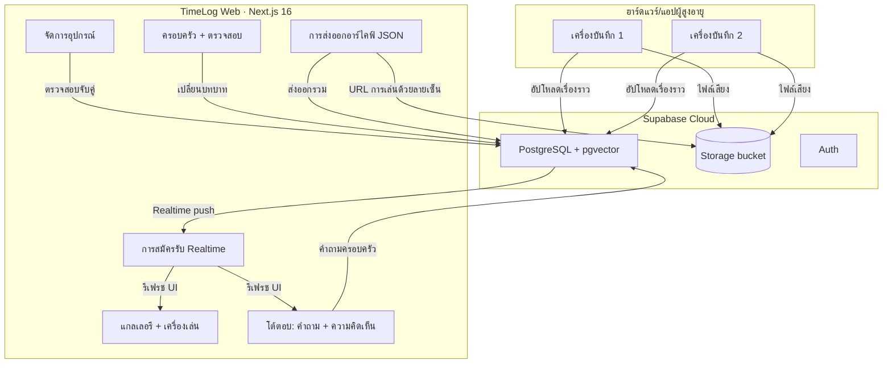
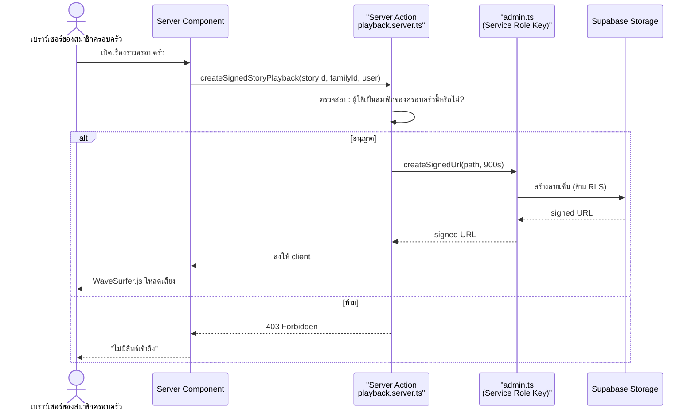

<!-- 
  Designed & Built with ❤️ by MeiSiristhebest (https://github.com/MeiSiristhebest)
  If this repository helps your learning or engineering, please consider dropping a ⭐ Star!
-->
# TimeLog Web 🕰️

<p align="center">
  <b><a href="./README.md">English</a> | <a href="./README_zh.md">简体中文</a> | ภาษาไทย</b>
</p>

> [!TIP]
> 💡 **หากสถาปัตยกรรมหรือโค้ดของโครงการนี้มีประโยชน์ต่อคุณ โปรดสนับสนุนด้วยการกด ⭐ Star!**
> 📚 อ่านเอกสารสถาปัตยกรรม: [ARCHITECTURE.md](./ARCHITECTURE.md)


<p align="center">
  <a href="https://github.com/MeiSiristhebest/timelog-web/actions/workflows/ci.yml"></a>
  <a href="https://app.netlify.com/sites/timelog-web/deploys"></a>
  <a href="https://github.com/MeiSiristhebest/timelog-web/blob/master/LICENSE"></a>
  
  
  
  
  
  <a href="DESIGN.md"></a>
</p>

<p align="center">
  <a href="README.md">🇨🇳 中文</a> &nbsp;|&nbsp; <a href="README_EN.md">🇺🇸 English</a> &nbsp;|&nbsp; <a href="README_TH.md">🇹🇭 ไทย</a>
</p>

---

<p align="center">
  <strong>คอนโซลเว็บสำหรับเก็บรักษาเรื่องราวครอบครัวข้ามรุ่น</strong>
</p>

## สารบัญ (Table of Contents)

- [เกี่ยวกับ (About)](#เกี่ยวกับ-about)
- [คุณสมบัติ (Features)](#คุณสมบัติ-features)
- [ความต้องการ (Requirements)](#ความต้องการ-requirements)
- [การติดตั้ง (Installation)](#การติดตั้ง-installation)
- [เริ่มต้นใช้งาน (Quick Start)](#เริ่มต้นใช้งาน-quick-start)
- [การกำหนดค่า (Configuration)](#การกำหนดค่า-configuration)
- [สถาปัตยกรรม (Architecture)](#สถาปัตยกรรม-architecture)
- [โครงสร้างโปรเจกต์ (Project Structure)](#โครงสร้างโปรเจกต์-project-structure)
- [สแต็กเทคโนโลยี (Tech Stack)](#สแต็กเทคโนโลยี-tech-stack)
- [คำสั่งพัฒนา (Development Commands)](#คำสั่งพัฒนา-development-commands)
- [การมีส่วนร่วม (Contributing)](#การมีส่วนร่วม-contributing)
- [ความปลอดภัย (Security)](#ความปลอดภัย-security)
- [การดีพลอย (Deployment)](#การดีพลอย-deployment)
- [สัญญาอนุญาต (License)](#สัญญาอนุญาต-license)

---

## เกี่ยวกับ (About)

TimeLog Web คือคอนโซลเว็บของระบบความทรงจำครอบครัว TimeLog สำหรับสมาชิกในครอบครัวในการจัดการไฟล์เสียงเรื่องราวที่ผู้สูงอายุบันทึก, ข้อความที่ AI สร้าง, และดัชนีเชิงความหมาย

**สถานการณ์ปัญหา**: ผู้สูงอายุหลายท่านมีเรื่องราวชีวิตที่อุดมสมบูรณ์ แต่ลูกหลานมักอยู่ห่างไกลและการอยู่ร่วมกันสามรุ่นเป็นเรื่องยาก ความทรงจำร่วมกันของครอบครัวจางหายไปเมื่อส่งต่อด้วยคำพูดปากเปล่า TimeLog Web รวบรวมเรื่องราวที่บันทึกด้วยฮาร์ดแวร์/แอปของผู้สูงอายุไว้ในที่เดียว เพื่อให้สมาชิกครอบครัวสามารถ:

1. เรียกดูและเล่นไฟล์เรื่องราวทั้งหมดของครอบครัว
2. ส่งคำถามเพื่อกระตุ้นให้ผู้สูงอายุบันทึกเรื่องราวใหม่
3. แสดงความคิดเห็นด้วยข้อความหรือเสียง จัดตามบทบาทของสมาชิกในครอบครัว
4. ค้นหาเนื้อหาที่เกี่ยวข้องในฐานข้อมูลเรื่องราวด้วยคำค้นหาเพียงหนึ่งประโยค
5. ส่งออกข้อมูลทั้งหมดเป็นไฟล์ JSON — ข้อมูลของคุณไม่ถูกล็อกโดยแพลตฟอร์ม
6. จัดการจับคู่อุปกรณ์และตั้งชื่อเล่น
7. ใช้แอปในภาษาอังกฤษ, 中文, หรือ ไทย
8. เพลิดเพลินกับอินเทอร์เฟซที่เข้าถึงได้ตามมาตรฐาน WCAG 2.2 AAA

> **ทำไมไม่ใช้แอปอัลบั้มรูปครอบครัวที่มีอยู่แล้ว?** เพราะแอปเหล่านั้นถูกสร้างมาสำหรับรูปภาพ ไม่ใช่ไฟล์เสียงระยะยาว พวกมันไม่มีการเน้นข้อความ-เสียง, การค้นหาเชิงความหมาย, การควบคุมสิทธ์สมาชิกครอบครัวตาม RLS, หรือวงจรโต้ตอบ "ครอบครัวถาม → ผู้สูงอายุบันทึก → ครอบครัวแสดงความคิดเห็น" TimeLog ถูกสร้างมาเพื่อเติมช่องว่างนี้

---

## คุณสมบัติ (Features)

| # | คุณสมบัติ | การทำงาน | หมายเหตุ |
|---|---------|---------|---------|
| 1 | **การเล่นเสียงที่ปลอดภัย** | ไฟล์เสียงอยู่ในบั๊กเก็ตส่วนตัวของ Supabase เซิร์ฟเวอร์ตรวจสอบสมาชิกครอบครัวและสร้าง URL ที่มีลายเซ็นมีระยะเวลาจำกัดสำหรับ WaveSurfer.js | URL ลายเซ็นมีอายุ 15 นาทีและรีเฟรชอัตโนมัติ |
| 2 | **การโต้ตอบสองทาง** | ตัวติดตามคำถาม (`prompts-tracker.tsx`) แสดงสถานะ; Web Audio API บันทึกความคิดเห็นด้วยเสียง | มีเทมเพลตคำถาม 30+ แบบพร้อมใช้งาน |
| 3 | **จับคู่อุปกรณ์โดยไม่ต้องรหัสผ่าน** | รหัสจับคู่เชื่อมต่ออุปกรณ์ของผู้สูงอายุเข้ากับครอบครัว เปลี่ยนชื่อในคอนโซลได้ (เช่น "กล่องเสียงของคุณย่า") | ทำงานกับแอป Android / iOS ของผู้สูงอายุ |
| 4 | **การค้นหาเชิงความหมาย** | ข้อความเรื่องราวถูกฝังลงใน PostgreSQL ผ่าน pgvector — ค้นหาด้วยคำเดียวพบช่วงที่เกี่ยวข้องที่สุด | ใช้ `text-embedding-3-small` |
| 5 | **หลายภาษา (EN / ZH / TH)** | `next-intl` ขับเคลื่อนทั้งแอป สตริงทั้งหมดอยู่ใน `messages/{en,zh,th}.json` | ไม่มีการโหลดหน้าเว็บซ้ำเมื่อสลับภาษา |
| 6 | **ระบบการออกแบบที่เข้าถึงได้** | จานสี Obsidian + Parchment + Sand; ตัวพิมพ์ Cormorant Garamond + Instrument Sans; แหวนโฟกัส ≥ 3:1 คอนทราสต์ | ดู [DESIGN.md](DESIGN.md) |
| 7 | **การส่งออกเพื่ออธิปไตยข้อมูล** | Server Action รวบรวมเรื่องราว, ข้อความ, ความคิดเห็น, และเมตาดาต้าเป็นไฟล์ JSON เดียว | สอดคล้องกับ GDPR |
| 8 | **การซิงค์แบบเรียลไทม์** | Supabase Realtime สมัครรับการเปลี่ยนแปลง Postgres — UI อัปเดตในวินาที | เชื่อมต่อใหม่อัตโนมัติหลังจากแท็บหยุดชั่วครู่ |
| 9 | **บันทึกการตรวจสอบ** | การดำเนินการของครอบครัว, อุปกรณ์, บทบาท, และการส่งออกทั้งหมดถูกบันทึก; ผู้ดูแลสามารถกรองตามเวลา | เฉพาะผู้ดูแลระบบเท่านั้น |

---

## ความต้องการ (Requirements)

| สิ่งที่ต้องใช้ | เวอร์ชันต่ำสุด |
|--------------|--------------|
| **Node.js** | 20.19.0 |
| **pnpm** | 10.33.0 |
| **Supabase** | โปรเจกต์ Supabase (แผนฟรีใช้ได้) ต้องเปิดใช้งาน PostgreSQL, Storage, Auth, Realtime, และ pgvector |
| **เบราว์เซอร์** | Chrome 110+ / Safari 16.4+ / Edge 110+ / Firefox 113+ |
| **(ไม่บังคับ) Netlify** | สำหรับการดีพลอยแบบคลิกเดียว; ก็สามารถใช้ Vercel ได้ |

---

## การติดตั้ง (Installation)

### 1. โคลนและติดตั้ง

```bash
git clone https://github.com/MeiSiristhebest/timelog-web.git
cd timelog-web

# แนะนำ: ตั้งค่า pnpm ด้วย Corepack
corepack enable
corepack prepare pnpm@10.33.0 --activate

# ติดตั้งแพ็กเกจ
pnpm install --frozen-lockfile
```

### 2. เริ่มต้น Supabase

รันสคริปต์ SQL จากรีโปตรูทใน Supabase SQL Editor:

```bash
psql <your-pg-conn-string> < supabase-role-management.sql
psql <your-pg-conn-string> < supabase-admin-setup.sql
psql <your-pg-conn-string> < supabase-fix-rls.sql
psql <your-pg-conn-string> < supabase-quick-admin.sql
# ไม่บังคับ: ลดรูปแบบบทบาท
psql <your-pg-conn-string> < simplify-roles.sql
```

### 3. ตรวจสอบไฟล์ภาษา

```bash
ls messages/
# ต้องมี: en.json  zh.json  th.json
```

---

## เริ่มต้นใช้งาน (Quick Start)

> เงื่อนไข: ขั้นตอนการติดตั้งเสร็จสมบูรณ์, Supabase เชื่อมต่อได้

```bash
# เริ่มเซิร์ฟเวอร์พัฒนา
pnpm dev
# เข้าถึง http://localhost:3000

# รันการตรวจสอบคุณภาพทั้งหมด
pnpm check
# lint → typecheck → test → build
```

### การทดสอบด้วยเบราว์เซอร์

1. เปิด `http://localhost:3000`, เข้าสู่ระบบด้วยบัญชีผู้ดูแลที่สร้างโดย `supabase-quick-admin.sql`
2. **แกลเลอรีเรื่องราว**: เรียกดูการบันทึกของผู้สูงอายุ (สถานะว่างก็ได้)
3. **การจัดการอุปกรณ์ → เพิ่มอุปกรณ์**: สร้างรหัสจับคู่, จับคู่, เปลี่ยนชื่อ (เช่น "กล่องเสียงของคุณย่า")
4. **สมาชิกครอบครัว**: เชิญสมาชิกใหม่, ตั้งบทบาท
5. **บันทึกการตรวจสอบ**: ยืนยันว่าการดำเนินการถูกบันทึก
6. **การเข้าถึงได้**: สแกน Lighthouse Accessibility, เป้าหมาย ≥ 98

---

## การกำหนดค่า (Configuration)

สร้างไฟล์ `.env.local` ที่รีโปตรูท:

```env
# Supabase client anon key (ปลอดภัยที่จะเปิดเผยให้เบราว์เซอร์)
NEXT_PUBLIC_SUPABASE_URL="https://xxxxxxxxxxxx.supabase.co"
NEXT_PUBLIC_SUPABASE_ANON_KEY="eyJhbGciOiJIUzI1NiIsInR5cCI6IkpXVCJ9......"

# Supabase Service Role Key (★ ห้าม commit หรือเปิดเผยให้เบราว์เซอร์ ★)
# ใช้เฉพาะใน src/lib/supabase/admin.ts
SUPABASE_SERVICE_ROLE_KEY="eyJhbGciOiJIUzI1NiIsInR5cCI6IkpXVCJ9......"

# NextAuth (สร้างด้วย: openssl rand -hex 32)
NEXTAUTH_SECRET="your-64-char-hex-secret"
NEXTAUTH_URL="http://localhost:3000"
```

---

## สถาปัตยกรรม (Architecture)

### โฟลว์โดยรวม



### การเล่นเสียงที่ปลอดภัย



**ไฟล์ซอร์สสำคัญ:**

- [subscriptions.ts](src/features/realtime/subscriptions.ts) — การสมัครรับ Realtime
- [page.tsx](src/app/(dashboard)/stories/page.tsx) — แกลเลอรีเรื่องราว
- [admin.ts](src/lib/supabase/admin.ts) — โมดูลเดียวที่ใช้ Service Role Key
- [playback.server.ts](src/features/stories/playback.server.ts) — การสร้าง URL ลายเซ็น

---

## โครงสร้างโปรเจกต์ (Project Structure)

```text
timelog-web/
├── .github/workflows/
│   ├── ci.yml                         # CI: ESLint + TSC + Vitest + Build
│   └── deploy.yml                     # ดีพลอยไปยัง Netlify
├── messages/                          # ไฟล์ภาษา i18n
│   ├── en.json                        # 🇺🇸 English
│   ├── zh.json                        # 🇨🇳 中文
│   └── th.json                        # 🇹🇭 ไทย
├── public/                            # สมมติฐานข้อมูลสาธารณะ
├── src/
│   ├── app/                           # Next.js 16 App Router
│   │   ├── (auth)/                    #   เข้าสู่ระบบ / สมัครสมาชิก
│   │   ├── (dashboard)/               #   คอนโซล
│   │   │   ├── stories/               #     แกลเลอรี + เครื่องเล่น
│   │   │   ├── devices/               #     จัดการอุปกรณ์
│   │   │   ├── family/                #     สมาชิกครอบครัว
│   │   │   ├── audit/                 #     บันทึกการตรวจสอบ
│   │   │   ├── search/                #     ค้นหาเชิงความหมาย
│   │   │   └── settings/              #     การตั้งค่า
│   │   └── api/                       #   เส้นทาง API
│   ├── components/                    # ส่วนประกอบที่ใช้ร่วมกัน
│   │   ├── admin/                     #   ส่วนประกอบผู้ดูแล
│   │   ├── dashboard/                 #   แถบด้านบน, แถบด้านข้าง, สถานะว่าง
│   │   ├── layout/                    #   ส่วนประกอบเลย์เอาต์
│   │   └── ui/                        #   Radix + Tailwind primitives
│   ├── contexts/                      # Contexts ส่วนกลาง
│   ├── features/                      # โมดูลธุรกิจ
│   │   ├── admin/                     #   ส่งออกอาร์ไคฟ์
│   │   ├── audit/                     #   บันทึกการตรวจสอบ
│   │   ├── devices/                   #   จับคู่อุปกรณ์
│   │   ├── family/                    #   จัดการสมาชิก
│   │   ├── interactions/              #   คำถาม + ความคิดเห็น
│   │   ├── realtime/                  #   การสมัครรับ Realtime
│   │   └── stories/                   #   แกนเรื่องราว
│   ├── hooks/                         # Shared hooks
│   ├── i18n/                          # next-intl config
│   ├── lib/
│   │   ├── supabase/
│   │   │   ├── client.ts              #   Client SupabaseClient
│   │   │   ├── server.ts              #   Server SupabaseClient
│   │   │   ├── admin.ts               #   ★ จุดเข้าใช้งาน Service Role Key เพียงจุดเดียว ★
│   │   │   └── env.ts                 #   การตรวจสอบสภาพแวดล้อม
│   │   └── hooks/                     #   Zustand stores
│   └── types/                         # ประเภทส่วนกลาง
├── DESIGN.md                          # สเปกระบบการออกแบบ
├── LICENSE
├── middleware.ts                      # Next.js middleware
├── next.config.ts                     # Next.js config
├── netlify.toml                       # Netlify deploy config
├── eslint.config.mjs                  # ESLint 9 config
├── package.json
├── pnpm-lock.yaml
├── tsconfig.json
└── supabase-*.sql                     # สคริปต์ SQL ของ Supabase
```

---

## สแต็กเทคโนโลยี (Tech Stack)

| หมวดหมู่ | เทคโนโลยี | หมายเหตุ |
|---------|-----------|---------|
| เฟรมเวิร์ก | Next.js 16.2.2 (App Router) | การเรนเดอร์ฝั่งเซิร์ฟเวอร์ + เส้นทางไฟล์ |
| UI | React 19.2.4 + Tailwind CSS 4.2.2 | คอมโพเนนต์ที่เข้าถึงได้บน Radix UI |
| ข้อมูล / แบ็กเอนด์ | Supabase 2.102 (PostgreSQL + pgvector + Storage + Auth + Realtime) | การค้นหาเวกเตอร์และการเล่นแบบลายเซ็น |
| ภาษาหลายภาษา | next-intl | อังกฤษ / 中文 / ไทย ไม่มีการโหลดหน้าใหม่ |
| สถานะ | Zustand | สถานะฝั่งไคลเอนต์เบาๆ |
| เสียง | WaveSurfer.js + Web Audio API | การเล่นคลื่นเสียงและการบันทึก |
| ภาษา | TypeScript | ปลอดภัยด้วยประเภทข้อมูล |
| การทดสอบ | Vitest | การทดสอบหน่วย (Unit test) |
| การดีพลอย | Netlify / Vercel | สินทรัพย์ static + ฟังก์ชันเซิร์ฟเวอร์ |

---

## คำสั่งพัฒนา (Development Commands)

```bash
pnpm dev                      # เซิร์ฟเวอร์พัฒนา, พอร์ต 3000
pnpm dev:host                 # เผยแพร่ไปยัง LAN
pnpm build && pnpm start      # บิลด์โปรดักชัน + รัน
pnpm lint                     # ตรวจสอบ ESLint
pnpm typecheck                # ตรวจสอบ TypeScript
pnpm test                     # Vitest
pnpm check                    # การตรวจสอบทั้งหมด: lint → typecheck → test → build
pnpm lint --fix               # จัดรูปแบบอัตโนมัติ
```

---

## การมีส่วนร่วม (Contributing)

ยินดีต้อนรับทุกการมีส่วนร่วม ขั้นตอนย่อ:

```bash
# 1. Fork → Clone → Branch
git checkout -b feat/your-feature

# 2. ผ่านการตรวจสอบคุณภาพ
pnpm check

# 3. Commit และเปิด PR
git commit -m "feat: your change"
git push origin feat/your-feature
```

**ปัญหาที่ดีสำหรับเริ่มต้น:**

- 🆕 ภาษาใหม่ (ญี่ปุ่น, เกาหลี, ฯลฯ): คัดลอก `messages/en.json` แล้วแปล
- 🧪 Unit test ของ Vitest
- 🧩 การแก้ไขการเข้าถึงได้

---

## ความปลอดภัย (Security)

| ความเสี่ยง | การลดความเสี่ยง |
|-----------|----------------|
| **Service Role Key รั่วไหล** | `.env.local` อยู่ใน `.gitignore`; ใช้เฉพาะ `admin.ts`; ตั้งค่าผ่านแผงตัวแปรสภาพแวดล้อม |
| **URL ลายเซ็นถูกแชร์ต่อ** | อายุ 15 นาที; สามารถย่อเหลือ 5 นาทีใน `playback.server.ts` |
| **RLS ตั้งค่าผิด** | ทุกตารางเปิดใช้ RLS ตามค่าเริ่มต้น; รัน `diagnose-family-rls.sql` ก่อนแก้ไข |
| **Session ถูกขโมย** | HTTPS + Secure Cookies + SameSite=Lax ในโปรดักชัน |
| **การบังคับรหัสจับคู่** | 5 ความพยายามต่อ 10 นาที → ล็อกเอาต์ |
| **การส่งออกอาร์ไคฟ์รั่วไหล** | เฉพาะผู้ดูแล; ทุกการดำเนินการถูกบันทึก |

**การเปิดเผยช่องโหว่**: อีเมล **`maox_neta@foxmail.com`** — อย่าเปิด Issue สาธารณะ เรามุ่งมั่นตอบสนองภายใน 24 ชั่วโมงแรก

---

## การดีพลอย (Deployment)

### Netlify

1. Netlify → Add new site → Import รีโปตรูนี้
2. ตั้งค่าตัวแปรสภาพแวดล้อม:
   - `NEXT_PUBLIC_SUPABASE_URL`
   - `NEXT_PUBLIC_SUPABASE_ANON_KEY`
   - `SUPABASE_SERVICE_ROLE_KEY` (ทำเครื่องหมายเป็น Sensitive)
   - `NEXTAUTH_SECRET`
3. ดีพลอย — บิลด์แรกใช้เวลาประมาณ 2-4 นาที

### Vercel

ก็รองรับ เพิ่มตัวแปรสภาพแวดล้อมเดียวกันใน Vercel Project Settings

---

## สัญญาอนุญาต (License)

MIT License ดูที่ [LICENSE](LICENSE)

---

<p align="center">
  <em>สร้างด้วย ❤️ สำหรับโครงการอาวุโส · มาตรฐานการเข้าถึงได้ WCAG 2.2 AAA สำหรับผู้สูงอายุ</em>
</p>

---

## ⭐ สนับสนุนและให้ Star

หากโครงการนี้มีประโยชน์หรือสร้างแรงบันดาลใจให้กับการเรียนรู้หรือการพัฒนาของคุณ โปรดสนับสนุนด้วยการกด ⭐ **Star** บน GitHub!

<p align="left">
  <a href="https://github.com/MeiSiristhebest/timelog-web/stargazers">
    
  </a>
  <a href="https://github.com/MeiSiristhebest/timelog-web/network/members">
    
  </a>
</p>

### 🤝 ผู้มีส่วนร่วมพัฒนา (Contributors)
<a href="https://github.com/MeiSiristhebest/timelog-web/graphs/contributors">
  
</a>

<!-- Scarf Telemetry Pixel -->

