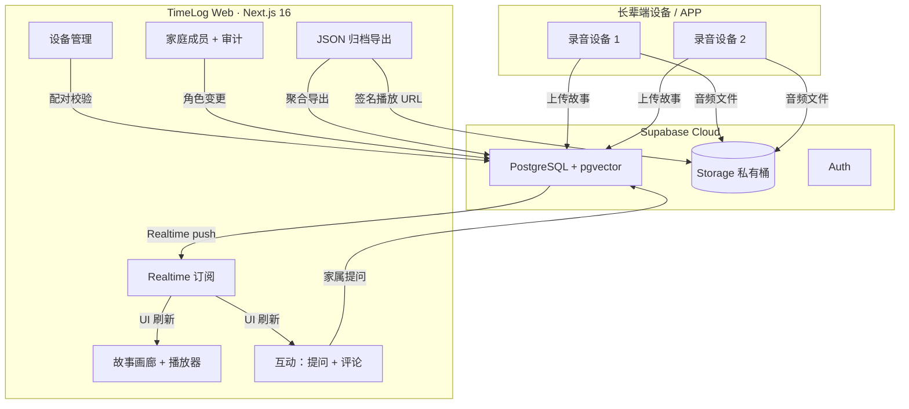
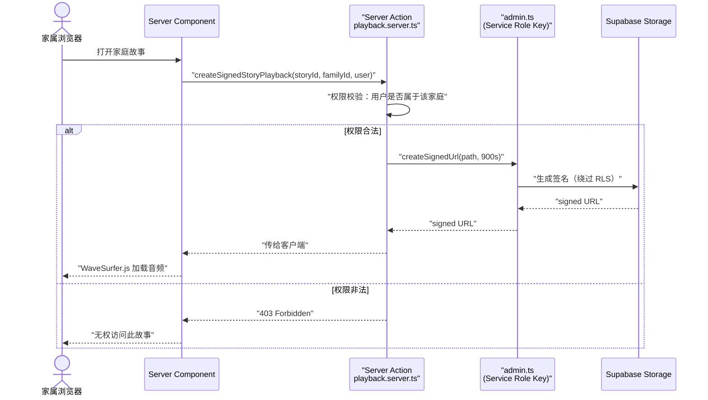

<!-- 
  Designed & Built with ❤️ by MeiSiristhebest (https://github.com/MeiSiristhebest)
  If this repository helps your learning or engineering, please consider dropping a ⭐ Star!
-->
# TimeLog Web 🕰️

<p align="center">
  <b><a href="./README.md">English</a> | 简体中文 | <a href="./README_TH.md">ภาษาไทย</a></b>
</p>

> [!TIP]
> 💡 **如果本项目的架构设计、工程实践或开源基础设施对您有所启发，欢迎点亮右上角 ⭐ Star 支持创作者！**
> 📚 查阅核心架构设计文档：[ARCHITECTURE_zh.md](./ARCHITECTURE_zh.md)


<p align="center">
  <a href="https://github.com/MeiSiristhebest/timelog-web/actions/workflows/ci.yml"></a>
  <a href="https://app.netlify.com/sites/timelog-web/deploys"></a>
  <a href="https://github.com/MeiSiristhebest/timelog-web/blob/master/LICENSE"></a>
  
  
  
  
  
  <a href="DESIGN.md"></a>
</p>

<p align="center">
  <a href="README.md">🇨🇳 中文</a> &nbsp;|&nbsp; <a href="README_EN.md">🇺🇸 English</a> &nbsp;|&nbsp; <a href="README_TH.md">🇹🇭 ไทย</a>
</p>


---

<p align="center">
  <strong>跨代家庭故事留存与治理的 Web 控制台</strong>
</p>

## 目录 (Table of Contents)

- [关于 (About)](#关于-about)
- [核心功能 (Features)](#核心功能-features)
- [环境要求 (Requirements)](#环境要求-requirements)
- [安装 (Installation)](#安装-installation)
- [快速开始 (Quick Start)](#快速开始-quick-start)
- [配置 (Configuration)](#配置-configuration)
- [架构概览 (Architecture)](#架构概览-architecture)
- [项目结构 (Project Structure)](#项目结构-project-structure)
- [技术栈 (Tech Stack)](#技术栈-tech-stack)
- [开发命令 (Development Commands)](#开发命令-development-commands)
- [参与贡献 (Contributing)](#参与贡献-contributing)
- [安全说明 (Security)](#安全说明-security)
- [部署 (Deployment)](#部署-deployment)
- [许可证 (License)](#许可证-license)

---

## 关于 (About)

TimeLog Web 是 TimeLog 分布式家庭记忆系统的 Web 控制台，供家属统一管理长辈端录制的故事音频、AI 转写文本与语义索引。

**核心场景**：很多老人拥有丰富的人生故事，但子女常年在外、三代同住较少，家庭共同故事在口耳相传中快速流失。TimeLog Web 把长辈端硬件/APP 录制的故事集中管理，让家属可以：

1. 浏览与播放全家的故事档案
2. 发送引导性提问，反向触发长辈新的录音
3. 文本 + 语音评论互动，按家庭成员做角色区分
4. 用一句话在全家故事库里做语义检索
5. 一键导出全量 JSON 归档，数据不被平台锁定
6. 设备配对与别名管理
7. 英 / 中 / 泰三语国际化
8. WCAG 2.2 AAA 高对比度无障碍视觉系统

> **为什么不直接用家庭相册类产品？** 现有家庭相册产品（Google Photos / 微信家庭相册等）主要解决照片存储，对长音频的支持很差：没有逐字稿与音频同步高亮、没有基于语义的故事检索、没有基于 RLS 的细粒度家庭成员权限隔离、也没有"家属提问 → 长辈录音 → 家属评论"的互动闭环。TimeLog 的整套架构就是为了填补这个空白。

---

## 核心功能 (Features)

| # | 功能 | 实现方式 | 备注 |
|---|------|---------|------|
| 1 | **安全音频播放** | 音频存在 Supabase Storage 私有桶，服务端用 Service Role Key 按家庭权限校验后生成限时签名 URL，由 WaveSurfer.js 渲染 | 签名 URL 有效期 15 分钟，超时自动重签 |
| 2 | **双向互动** | 引导提问追踪器 `prompts-tracker.tsx` 实时追踪状态；Web Audio API 录音上传 | 内置 30+ 场景化提问模板 |
| 3 | **免密设备配对** | 配对码建立设备与家庭的关联，家属可在控制台给设备改别名（如"外婆的话匣子"） | 兼容 Android / iOS 长辈端 |
| 4 | **语义检索** | 故事逐字稿以 embedding 向量存入 pgvector 扩展，一句话查询相关段落 | 默认使用 text-embedding-3-small |
| 5 | **三语国际化** | `next-intl` 驱动全站，硬编码字符串提取到 `messages/{en,zh,th}.json` | 切换无刷新 |
| 6 | **无障碍视觉系统** | Obsidian + Parchment + Sand 双色调；Cormorant Garamond + Instrument Sans 双字型；所有焦点环 ≥ 3:1 对比 | 详见 [DESIGN.md](DESIGN.md) |
| 7 | **数据主权导出** | Server Action 一键聚合故事、逐字稿、评论、元数据为 JSON 归档 | 符合 GDPR 数据可携带权 |
| 8 | **实时同步** | Supabase Realtime 订阅 Postgres 变更，秒级刷新 | 支持 tab 切换后自动重连 |
| 9 | **审计日志** | 家庭成员、设备、角色、导出操作均记录，管理员可按时间筛选 | 仅管理员可访问 |

---

## 环境要求 (Requirements)

| 依赖 | 最低版本 |
|------|---------|
| **Node.js** | 20.19.0 |
| **pnpm** | 10.33.0 |
| **Supabase** | 一个 Supabase 项目（Free Plan 起步即可），需启用 PostgreSQL、Storage、Auth、Realtime、pgvector |
| **浏览器** | Chrome 110+ / Safari 16.4+ / Edge 110+ / Firefox 113+ |
| **（可选）Netlify** | 用于一键部署；也可部署到 Vercel |

---

## 安装 (Installation)

### 1. 克隆并安装依赖

```bash
git clone https://github.com/MeiSiristhebest/timelog-web.git
cd timelog-web

# 建议用 Corepack 对齐 pnpm 版本
corepack enable
corepack prepare pnpm@10.33.0 --activate

# 安装依赖
pnpm install --frozen-lockfile
```

### 2. 初始化 Supabase

在 Supabase SQL Editor 中按顺序执行仓库根目录下的 SQL 脚本：

```bash
psql <your-pg-conn-string> < supabase-role-management.sql
psql <your-pg-conn-string> < supabase-admin-setup.sql
psql <your-pg-conn-string> < supabase-fix-rls.sql
psql <your-pg-conn-string> < supabase-quick-admin.sql
# 可选：简化角色体系
psql <your-pg-conn-string> < simplify-roles.sql
```

### 3. 确认语言文件存在

```bash
ls messages/
# 必须包含：en.json  zh.json  th.json
```

---

## 快速开始 (Quick Start)

> 前提：安装步骤全部完成，Supabase 项目可正常连接。

```bash
# 启动开发服务器
pnpm dev
# 访问 http://localhost:3000

# 跑全量质量门禁
pnpm check
# lint → typecheck → test → build
```

**预期输出**：

```bash
▲ Next.js 16.x.x
- Local:        http://localhost:3000
- Environments: .env.local, .env
✓ Ready in XXX ms
```

### 浏览器端到端验证

1. 打开 `http://localhost:3000`，用 `supabase-quick-admin.sql` 创建的管理员账号登录
2. **故事画廊**：查看长辈端录音卡片（空状态也正常）
3. **设备管理 → 新增设备**：生成配对码，配对后改别名（如"外婆的话匣子"）
4. **家庭成员**：邀请新成员，设置角色
5. **审计日志**：确认操作留有记录
6. **无障碍自检**：Lighthouse Accessibility 扫描，目标 ≥ 98 分

---

## 配置 (Configuration)

在仓库根目录创建 `.env.local`：

```env
# Supabase 客户端匿名 Key（可暴露给浏览器）
NEXT_PUBLIC_SUPABASE_URL="https://xxxxxxxxxxxx.supabase.co"
NEXT_PUBLIC_SUPABASE_ANON_KEY="eyJhbGciOiJIUzI1NiIsInR5cCI6IkpXVCJ9......"

# Supabase Service Role Key（★ 绝对不要提交 Git 或暴露给浏览器 ★）
# 仅在 src/lib/supabase/admin.ts 中使用
SUPABASE_SERVICE_ROLE_KEY="eyJhbGciOiJIUzI1NiIsInR5cCI6IkpXVCJ9......"

# NextAuth 配置（openssl rand -hex 32 生成）
NEXTAUTH_SECRET="your-64-char-hex-secret"
NEXTAUTH_URL="http://localhost:3000"
```

---

## 架构概览 (Architecture)

### 整体流程



### 安全音频播放流程



**关键源码入口**：

- [subscriptions.ts](src/features/realtime/subscriptions.ts) — Realtime 订阅
- [page.tsx](src/app/(dashboard)/stories/page.tsx) — 故事画廊
- [admin.ts](src/lib/supabase/admin.ts) — 唯一使用 Service Role Key 的模块
- [playback.server.ts](src/features/stories/playback.server.ts) — 签名 URL 生成

---

## 项目结构 (Project Structure)

```text
timelog-web/
├── .github/workflows/
│   ├── ci.yml                         # CI：ESLint + TSC + Vitest + Build
│   └── deploy.yml                     # 部署到 Netlify
├── messages/                          # i18n 三语文案
│   ├── en.json                        # 🇺🇸 English
│   ├── zh.json                        # 🇨🇳 中文
│   └── th.json                        # 🇹🇭 ไทย
├── public/                             # 静态资源
├── src/
│   ├── app/                           # Next.js 16 App Router
│   │   ├── (auth)/                    #   登录 / 注册
│   │   ├── (dashboard)/               #   控制台
│   │   │   ├── stories/               #     故事画廊 + 播放
│   │   │   ├── devices/               #     设备管理
│   │   │   ├── family/                #     家庭成员
│   │   │   ├── audit/                 #     审计日志
│   │   │   ├── search/                #     语义检索
│   │   │   └── settings/              #     偏好设置
│   │   └── api/                       #   API 路由
│   ├── components/                    # 共享组件
│   │   ├── admin/                     #   管理员组件
│   │   ├── dashboard/                 #   顶栏、侧栏、空状态
│   │   ├── layout/                    #   布局组件
│   │   └── ui/                        #   Radix + Tailwind 无障碍组件
│   ├── contexts/                      # 全局 Context
│   ├── features/                      # 业务模块
│   │   ├── admin/                     #   归档导出
│   │   ├── audit/                     #   审计日志
│   │   ├── devices/                   #   设备配对
│   │   ├── family/                    #   成员管理
│   │   ├── interactions/              #   提问 + 评论
│   │   ├── realtime/                  #   Realtime 订阅
│   │   └── stories/                   #   故事核心
│   ├── hooks/                         # 共享 Hooks
│   ├── i18n/                          # next-intl 配置
│   ├── lib/
│   │   ├── supabase/
│   │   │   ├── client.ts              #   客户端 SupabaseClient
│   │   │   ├── server.ts              #   服务端 SupabaseClient
│   │   │   ├── admin.ts               #   ★ Service Role Key 唯一入口 ★
│   │   │   └── env.ts                 #   环境变量校验
│   │   └── hooks/                     #   Zustand stores
│   └── types/                         # 全局类型
├── DESIGN.md                          # 设计系统规范
├── LICENSE
├── middleware.ts                      # Next.js 中间件
├── next.config.ts                     # Next.js 配置
├── netlify.toml                       # Netlify 部署配置
├── eslint.config.mjs                  # ESLint 9 配置
├── package.json
├── pnpm-lock.yaml
├── tsconfig.json
└── supabase-*.sql                     # Supabase SQL 脚本集
```

---

## 技术栈 (Tech Stack)

| 分类 | 技术 | 说明 |
|------|------|------|
| 框架 | Next.js 16.2.2（App Router） | 服务端渲染 + 文件路由 |
| UI | React 19.2.4 + Tailwind CSS 4.2.2 | 无障碍组件基于 Radix UI |
| 数据 / 后端 | Supabase 2.102（PostgreSQL + pgvector + Storage + Auth + Realtime） | 向量检索与签名播放 |
| 国际化 | next-intl | 英 / 中 / 泰三语，切换无刷新 |
| 状态管理 | Zustand | 客户端轻量状态 |
| 音频 | WaveSurfer.js + Web Audio API | 波形播放与录音上传 |
| 语言 | TypeScript | 全量类型安全 |
| 测试 | Vitest | 单元测试 |
| 部署 | Netlify / Vercel | 静态资源 + 服务端函数 |

---

## 开发命令 (Development Commands)

```bash
pnpm dev                      # 开发服务器，端口 3000
pnpm dev:host                 # 暴露到局域网
pnpm build && pnpm start      # 生产构建 + 本地启动
pnpm lint                     # ESLint 检查
pnpm typecheck                # TypeScript 类型检查
pnpm test                     # Vitest 测试
pnpm check                    # 全套门禁：lint → typecheck → test → build
pnpm lint --fix               # 自动格式化
```

---

## 参与贡献 (Contributing)

欢迎贡献代码。简要流程：

```bash
# 1. Fork → Clone → 切分支
git checkout -b feat/your-feature

# 2. 通过质量门禁
pnpm check

# 3. Commit 并提 PR
git commit -m "feat: your change"
git push origin feat/your-feature
```

**欢迎贡献的方向**：

- 🆕 新增语言（日语、韩语等）：复制 `messages/en.json` 翻译即可
- 🧪 补充 Vitest 单元测试
- 🧩 修复无障碍细节

---

## 安全说明 (Security)

| 风险场景 | 防护措施 |
|---------|---------|
| **Service Role Key 泄露** | `.env.local` 已加入 `.gitignore`；仅 `admin.ts` 使用；通过环境变量面板配置 |
| **签名 URL 被二次分享** | 默认有效期 15 分钟；可在 `playback.server.ts` 缩短到 5 分钟 |
| **RLS 策略误配** | 所有表默认启用 RLS；修改前跑 `diagnose-family-rls.sql` |
| **Session 劫持** | 生产强制 HTTPS + Secure Cookie + SameSite=Lax |
| **配对码暴力破解** | 10 分钟 5 次错误锁定 |
| **归档导出泄露** | 仅管理员可执行，所有操作记入审计日志 |

**漏洞上报**：发现安全问题请直接发邮件至 **`maox_neta@foxmail.com`**，不要公开在 Issue 里。承诺 24 小时内首次响应。

---

## 部署 (Deployment)

### Netlify 一键部署

1. Netlify → Add new site → Import 本仓库
2. 在 Environment Variables 中配置：
   - `NEXT_PUBLIC_SUPABASE_URL`
   - `NEXT_PUBLIC_SUPABASE_ANON_KEY`
   - `SUPABASE_SERVICE_ROLE_KEY`（标记为 Sensitive）
   - `NEXTAUTH_SECRET`
3. Deploy，首次构建约 2-4 分钟

### Vercel 部署

同样支持，将上述环境变量配到 Vercel Project Settings 即可。

---

---

---

## ⭐ 支持与 Star

如果本项目对您的学习、研究或工程落地有所帮助，欢迎给本项目点亮一颗 ⭐ **Star**！这是对开源创作者最大的鼓励与支持。

<p align="center">
  <a href="https://star-history.com/#MeiSiristhebest/timelog-web&Date">
    
  </a>
</p>

### 🤝 社区贡献者
<a href="https://github.com/MeiSiristhebest/timelog-web/graphs/contributors">
  
</a>

<!-- Scarf Telemetry Pixel -->

